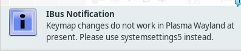

# H1 Oma Linux

## x)

## a)

Alkusanoina mainittakoon, että en ennen tätä tehtävää tiennyt Linuxin käytöstä juuri mitään, mutta olen sen kuitenkin asentanut useamman kerran vuosien varrella. Sama pätee muihinkin käyttöjärjestelmiin MS-DOS ajoista lähtien. En siis odottanut tämän tehtävän osalta suurempia ongelmia. Hankaluudet alkavat luultavasti vasta seuraavien tehtävien parissa.

### VirtualBox -asennus

Aloitin VirtualBoxin asentamisen hakemalla asennuspaketin VirtuaBoxin sivuilta (https://www.virtualbox.org/wiki/Downloads) tehtävän ohjeiden mukaisesti. Valitsin tarjolla olevista vaihtoehdoista Windows Hosts-version. Asennus sujui ilman ongelmia. Olin asentanut edellisen periodin Python kurssilla liittyviä sidonnaisuuksia, joten VirtualBoxin asennuksella ei ollut niistä huomauttamista. Valitsin VirtualBoxin aloitusnäkymästä oikealta 'Expert mode' vaihtoehdon ja aloitin uuden virtuaalikoneen luomisen 'New' napista.

Eteeni auenneissa virtuaalikoneen asetuksissa oli joitain eroja tehtävän ohjeiden kuvitukseen verrattuna. Käyttöjärjestelmävalikon alla oli 'Edition' kohta, jota en voinut muuttaa. Ohitin sen huoletta, koska se ei vaikuttanut tehtävän kannalta oleelliselta. Rautavalikossa oli poikkeuksena CPU asetus prosessoreiden määrälle. Jätin prosessori- ja muistiasetukset oletusarvoihinsa (1 ja 4GB). Kovalevyn asetuksissa suurimpana erona oli 'Dynamically allocated' vaihtoehdon puuttuminen. Koska vastaavalla paikalla oli asetus 'Pre-allocate Full Size', oletin dynaamisen allokoinnin olevan nykyään oletuksena. Seuraavaksi loin virtuaalikoneen, joka ilmestyi näkyviin vasempaan laitaan. Lähdin asettamaan .iso tiedostoa optiseen asemaan, mutta yllätyksekseni huomasin, että asia oli jo oletuksena kunnossa.

 
 
### Debian -asennus

Käynnistin virtuaalikoneen tuplaklikkaamalla ja hetken päästä eteeni aukesi Debianin boottivalikko. Valitsin valikosta 'Live system (amd64)' vaihtoehdon. Hetken odottelun ja muutaman ruudulla vilahtaneen varoitusviestin jälkeen olin Linux-työpöydällä.

 
 

Varoitusviesteistä ehdin lukea sanat Spectre ja CPU, joten oletin niiden olevan Debianin omia varoituksia vanhoista haavoittuvuuksista. Jätin ne huomiotta, koska ne eivät tuntuneet olevan tämän tehtävän kannalta oleellisia. Testasin hiiren, näppäimistön, näytön ja netin toimivuudet käynnistämällä selaimen ja tekemällä Google-haun. Kaikki tuntui toimivan moitteetta, mutta selain avautui huomattavan hitaasti. Syynä oli luultavasti virtuaalikoneelle annetut vaatimattomat resurssit.

 
 

Aloitin varsinaisen asennuksen työpöydältä (Install Debian). Valitsin kieleksi englannin (US), sijainniksi Suomen ja näppäimistön suomalaisella layoutilla. Näppäimistö oli tyypiltään 'Generic 105-key'. Testasin samalla ääkkösten toimivuuden. Kovalevyn partitioimisen asetuksissa valitsin kohdan 'Erase disk'. Tarkistin myös 'Boot loader location' kohdan ja sen, että salaus ei ollut päällä. Seuraavaksi asetin käyttäjätiedot ja tarkistin ettei automaattinen kirjautuminen ole käytössä. Yhteenvedon tarkistamisen jälkeen aloitin asennuksen, joka kesti noin 9 minuuttia.

 
 

Uudelleenkäynnistymisen yhteydessä ruudulla kävi hetkellisesti boottivalikko, jonka annoin valita oletusvaihtoehdon automaattisesti. Koska en kärsinyt tehtävänannossa mainitusta mustasta ruudusta, kirjautumisruutu avautui normaalisti.

 
 

Sisäänkirjautumisen jälkeen ruudulle ilmestyi outo 'Ibus notification', joka on ilmeisesti lähtöisin VirtualBoxista. Koska kaikki toimi normaalisti, en lähtenyt selvittelemään ilmoituksen syitä tarkemmin. 

 
 

Kirjautumisen yhteydessä ei mielestäni auennut ohjeissa mainittua 'Welcome' paneelia, josta olisin voinut valita 'Use default config'. Voi toki olla, että onnistuin sen ajatuksissani ohittamaan. Testasin taas nettiselainta, ja kaikki tuntui toimivan.

### Terminaali

Käynnistin terminaalin (Terminal Emulator) Applications-valikosta ja aloin ajamaan tehtävänannossa kerrottuja komentoja:

*sudo apt-get update*
*sudo apt-get -y dist-upgrade*

Salasanan antamisen jälkeen komennot suorittivat tehtävänsä ilman virheilmoituksia. Komentojen tuottama sekava ulosanti ei kertonut minulle juuri mitään tässä vaiheessa, mutta oleellisinta, että ne toimivat oikein.

 
 

Seuraavaksi asensin ja käynnistin palomuurin komennoilla:

*sudo apt-get -y install ufw*
*sudo ufw enable*

Komennot tuntuivat toimivan oikein ja sain ilmoituksen, että palomuuri toimii uudelleenkäynnistämisen jälkeen.

 
 

### Guest Additions -asennus

Seuraavaksi aloin asentamaan 'VirtualBox Guest Additions' ominaisuuksia. Asennus (sudo bash VBoxLinuxAdditions.run) sujui hyvin ja kuvaruudun koon muuttaminen onnistui jo ennen jäjrestelmän uudelleenkäynnistämistä. Copy-pasten toiminnassa oli pienenä ongelmana ctrl + c/v toimimattomuus terminaalissa. Muualla, kuten selaimessa, näppäinyhdistelmä toimii. Terminaalissa asia täytyy hoitaa valikon kautta. Nopealla googlauksella (AskUbuntu) ratkaisuksi löytyi ctrl + shift + c/v näppäinyhdistelmä.

 
 

Tässä vaiheessa otin virtuaalikoneesta snapshotin. 'Take snapshot' löytyin VirtualBoxin 'Machine' valikosta.

 
 

## k)

### Spotify -asennus

Suosikkiohjelmani on muissa käyttöjärjestelmissä Spotify, joten miksei myös Linuxissa. Koska sen käyttö ei poikkea Linuxissa mitenkään muista käyttöjärjestelmistä, valitsin yksinkertaisiksi toimenpiteiksi sen asentamisen ja sisäänkirjautumisen. Audion toimivaksi saattaminen on tässä vaiheessa ehkä liian vaativa toimenpide. Ennen suorien asennusohjeiden hakemista Googlen kautta, halusin kokeilla aiemmin opittuja komentoja.

*apt*

Komentokehotteista aiemmin opittuna asiana ajoin ensimmäiseksi apt ohjelman ilman lisäkomentoja. Odotetusti se tarjosi listan mahdollisia komentoja.

*apt list*

Seuraavaksi katsoin listaa tarjolla olevista paketeista, mutta lista oli aivan liian pitkä ollakseen hyödyllinen.

*apt search spotify*

Komennon tuloksena sain lyhyen listan paketeista, jotka eivät ainakaan päällisin puolin liittyneet hakuun mitenkään.

Tässä vaiheessa osaamiseni loppui, joten hain Googlesta apua. Haku johdatti minut Spotifyn sivuille asennusohjeisiin. Ohjeissa annettiin seuraavat komennot asennukseen seuraavassa muodossa: 

*curl -sS https:<!-- -->//download.spotify.com/debian/pubkey_C85668DF69375001.gpg | sudo gpg --dearmor --yes -o /etc/apt/trusted.gpg.d/spotify.gpg*
*echo "deb http:<!-- -->//repository.spotify.com stable non-free" | sudo tee /etc/apt/sources.list.d/spotify.list*

*sudo apt-get update && sudo apt-get install spotify-client*

Ensimmäiset kaksi riviä liittyvät ilmeisesti siihen, että spotifyn paketti ylipäätään löytyy asennettavaksi. Komentojen yksityiskohdista en osaa sanoa tarkemmin.

Kolmannelta riviltä löytyykin jo aiemmista osista tuttuja komentoja, joilla Spotify päivittyy pakettilistoille ja asentuu.

Komentojen ajamisen jälkeen Spotify asentuu kiltisti ja kirjautuminen onnistuu tutulla tavalla. Kuten odotinkin, musiikin kuuntelu ei onnistu audio-ongelmien takia. Ehkä myöhemmissä tehtävissä ja omissa testeissä tähänkin löytyy vastaus.

 
 
 
 
 
 
Tätä dokumenttia saa kopioida ja muokata GNU General Public License (versio 2 tai uudempi) mukaisesti. http://www.gnu.org/licenses/gpl.html  
Pohjana Tero Karvinen 2012: Linux kurssi, http://terokarvinen.com

