# H2 Komentaja Pingviini

## x)

-Command Line Basics Revisited -Sivut sisältävät hyödyllistä tietoa Linuxin komentokehotteen käytöstä ja sen peruskäskyistä.  

-Ohjeet sisältävät käskyjä tiedostojen ja hakemistojen kanssa työskentelyyn ja ohjeista käskyjä esimerkiksi hakemistojen välillä liikkumiseen, niiden sisällön tutkimiseen ja niiden muokkaamiseen. Tiedostoihin käsittelyyn on tarjolla käskyjä niiden siirtelyyn, kopioimiseen, poistamiseen ja muokkaamiseen liittyen.

-Ohjeista löytyy käskyjä myös etäkäyttöön SSH- ja SCP-komentoja hyödyntäen.

-Sivut sisältävät ohjeet yleisimmille tavoille saada apua ohjelmien käyttöön. Esimerkiksi man-komento ja --help valinta käskyjen yhteydessä.

-Ohjeet sisältävät kuvauksen Linuxin tiedostojärjestelmän tärkeimmistä kansioista, kuten juuri, etc/ ja käyttäjän kotikansio.

-Lopuksi ohjeista löytyy ohjeita pakettien hallintaan ja ohjelmien asennukseen liittyviin komentoihin.

## Rauta & VirtualBox asetukset

OS:      Windows 11 Pro  
CPU:     Intel Core i7-9700k @ 3.6GHz, 8 Core  
Emolevy: Z390 AORUS ELITE-CF  
Muisti:  32GB DDR4-3200  
OS SSD:  250GB Samsung EVO 860, Vapaana 116GB  
VM SSD:  1TB Samsung EVO 860, Vapaana 280GB  
GPU:     Nvidia RTX 4070 12GB  
Näyttö:  MSI OPTIX MAG341CQ

VirtualBox asetukset:  
Oletusasetukset, muutamia poikkeuksia lukuunottamatta:  
OS: Debian 12.9.0  
Video Memory: 256MB  
Base Memory: 8192MB  
Harddisk: 60GB

## Alkusanat

Käyn tässä raportissa läpi kurssin Linux-palvelimet (https://terokarvinen.com/linux-palvelimet/) h2-tehtävän asioita. Luettuani tehtävänannon, en odottanut suuria ongelmia tehtävien parissa ja ne sujuivatkin suurin piirtein ongelmitta. Lähdin liikkeelle sillä ajatuksella, että en etsi netistä valmiita vastauksia vaan yritän suoriutua etupäässä Linuxin oman dokumentaation avulla. Tässä yhteydessä huomasin, että osa ohjeista oli aika sekavia, ja niiden tulkitseminen vaatisi ehkä parempaa kokonaisymmärrystä Linuxista. Vaikka jotkut asiat jäivät vielä epäselviksi, oletan niiden selkeytyvän kurssin edetessä.

## a)

Käytin Micron asentamiseen edelliseltä tunnilta tuttua komentoa. Asennus sujui ilman virheilmoituksia. Tämän jälkeen testasin ohjelmaa luomalla test.txt tiedoston onnistuneesti.

&emsp;*sudo apt-get install micro*  
&emsp;*micro test.txt*

 
 
## b)

Aloitin tehtävän etsimällä tarkoitukseen sopivia ohjelmia. En tiennyt etukäteen mitään hyviä vaihtoehtoja, joten kahlasin läpi useita Reddit-keskusteluita, tein Google-hakuja ja selasin Linux.fi:n wikiä. Useassa lähteessä oli mainittu TLDR-ohjelma, jonka tarkoitus on tiivistää manuaaleja (man) helpommin pureskeltavaan muotoon. Toiseksi ohjelmaksi valikoitui Midnight Commander (https://www.linux.fi/wiki/Midnight_Commander). Käytin MS-DOS aikoina sen esikuvana toiminutta Norton Commanderia, joten nostalgian yliannostus oli lähellä ohjelman avauduttua. Kolmas valitsemani ohjelma oli tunneillakin nähty Cowsay, joka vaikutti hauskalta. Kukapa ei lehmistä pitäisi.

Aloitin asennuksen etsimällä ohjelmien paketeille nimiä 'apt search' -komentoa hyödyntämällä. Kaikkien hakujen listauksissa oli ohjelmia, jotka eivät päällisin puolin liittyneet käytettyihin hakutermeihin mitenkään. Onneksi joukosta löytyivät myös haluamani paketit.

&emsp;*apt-search tldr*  
&emsp;*apt-search cowsay*  
&emsp;*apt-search midnight commander*

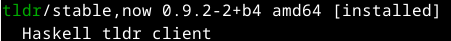  
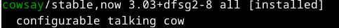  
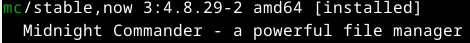
 
 
Komento kaikkien ohjelmien asentamiseen kerrallaan syntyi arvaamalla edellisen tunnin mkdir-komentojen avulla. Jos kansioita voi luoda tietyllä tavalla useamman kerrallaan, niin miksei sama logiikka toimisi myös asennuksissa. Asennus alkoi ja loppui ilman virheilmoituksia. Tämän jälkeen testasin ohjelmia seuraavilla komennoilla:

&emsp;*tldr cowsay*

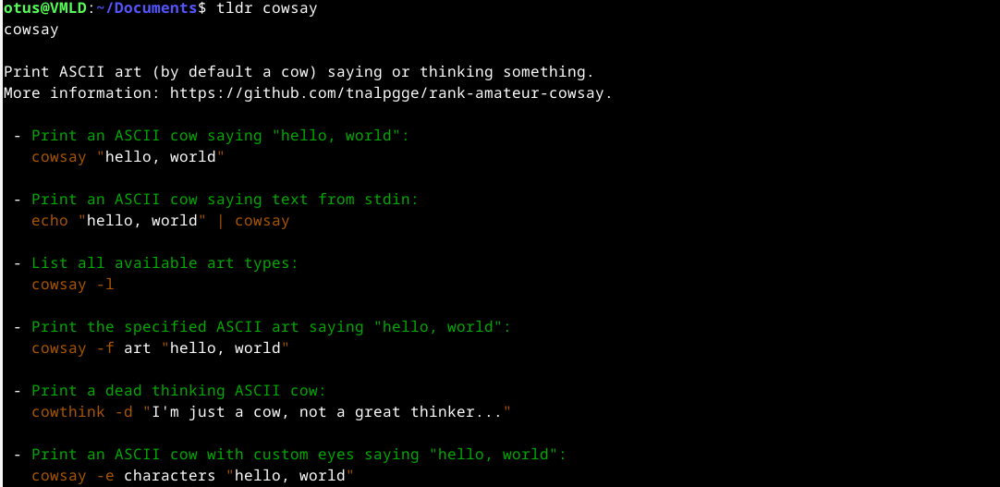
 
 
&emsp;*cowsay -e @@ Iltaa...*

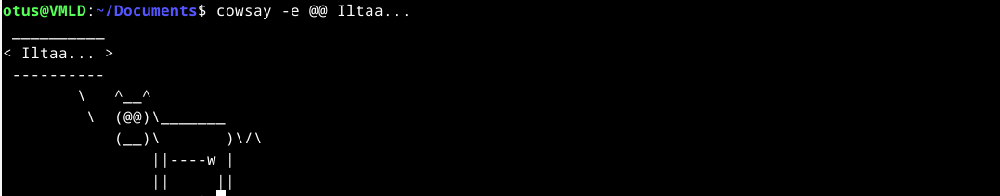
 
 
&emsp;*mc*

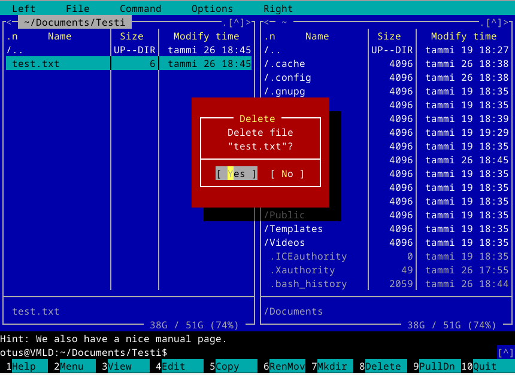
 
 
## c)

**/**

Tiedostojärjestelmän ylin taso, eli juurihakemisto. Hakemiston alta löytyvät kaikki järjestelmän tiedostot ja hakemistot. Esimerkkinä hakemiston sisällöstä mainittakoon etc-hakemisto, jonka alta löytyy koko käyttöjärjestelmän laajuisiin asetuksiin liittyviä tiedostoja.

&emsp;*ls -p*

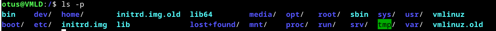
 
 
**/home/**

Tämän hakemiston sisältä löytyvät kaikkien käyttäjien kotihakemistot. Omasta virtuaalikoneestani löytyi vain yhden käyttäjän kansio.

&emsp;*ls-p*

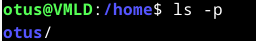
 
 
**/home/otus/**

Käyttäjän kotihakemisto. Tämä on ainoa hakemisto, johon tavallinen käyttäjä voi tallentaa tietoa pysyvästi. Hakemisto sisältää alihakemistot esimerkiksi dokumenteille, kuville ja medialle. Kansiosta löytyy myös Desktop-hakemisto, joka sisältää käyttäjän työpöydän tiedostot.

&emsp;*ls -p*  
&emsp;*cd desktop*  
&emsp;*echo test > test.txt*  
&emsp;*ls*

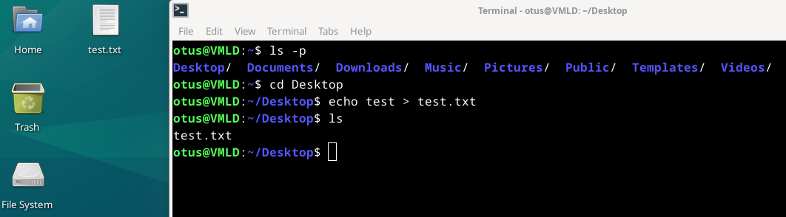
 
 
**/etc/**

Tämä hakemisto sisältää käyttöjärjestelmän laajuiset asetukset selkokielisinä tekstitiedostoina. Hakemisto sisältää esimerkiksi asetukset aiemmin asentamalleni Midnight Commander-ohjelmalle. Siirryin ohjelman kansioon ja tutkin sen sisältöä. Valitsin tarkasteluun mc.keymap tiedoston, josta näytin viisi ensimmäistä riviä. Riveillä näkyy muutettavissa olevia näppäinasetuksia. Käytetty head-komento (ja myöhemmin käytetty tail-komento) löytyivät Google-haun AI-osasta (How to see first lines of a file in Linux command line?)

&emsp;*cd mc*  
&emsp;*ls*  
&emsp;*head -n 5 mc.keymap*

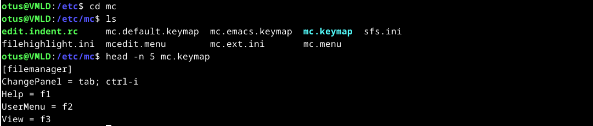
 
 
**/media/**

Tästä hakemistosta löytyvät ulkoiset tallennusmediat, kuten optiset asemat ja usb-tikut. Omassa järjestelmässäni löytyi vain yksi käyttäjän mukaan nimetty kansio, jonka tarkoituksena on luultavasti käytettyjen medioiden organisointi käyttäjien mukaan. Tämäkin hakemisto on tyhjä, koska virtuaalikoneeseeni ei ole liitetty mitään ylimääräistä.

&emsp;*ls -p*

 
 
**/var/log/**

Tähän hakemistoon sisältyy käyttöjärjestelmän laajuisten lokien tiedostot. Hakemistoa tutkimalla löysin alihakemiston apt, joka sisältää history.log tiedoston. Kyseisestä tiedostosta löytyi aiemmin ajamiani apt-get komentoja.

&emsp;*ls -p*  
&emsp;*cd apt*  
&emsp;*ls -p*  
&emsp;*tail -n 5 history.log*

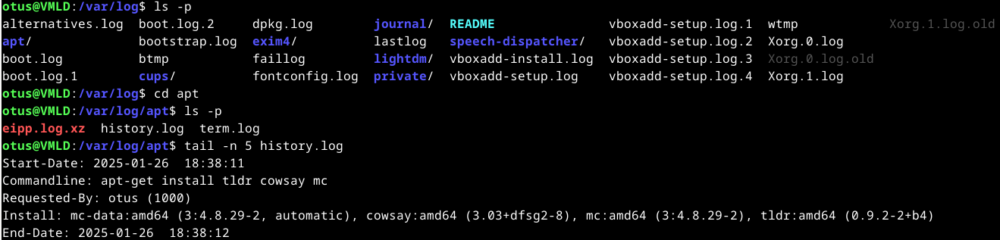
 
 
## d)

Koitin ensin grep-komentoa Micron manuaaliin putkea hyödyntämällä. Tarkoituksena oli löytää manuaalista quit-pikanappi ilman koko manuaalin selaamista. Kokeilu onnistui mainiosti.

&emsp;*man micro|grep "quit"*

 
 
Kokeilin seuraavaksi grep-komentoa kotihakemistosta käsin aiemmin mainittuun history.log tiedostoon ja sain tulokseksi pari riviä tekstiä, jotka sisälsivät 'cowsay' hakusanan. Valitsin riveistä oleellisimman, eli sen jossa oli listattu tehtävässä b) käytetty asennuskäsky ja tarkensin grep-komentoa lisäämällä sen hakuehtoon tarvittavat tiedot. Sen jälkeen hioin komentoa ottamalla mukaan '-C 3' valinnan, jonka piti käsittääkseni näyttää kolme riviä halutun rivin molemmilta puolilta. Tuloksena sain grep-komennon antamaan history.log tiedostosta kaikki rivit, jotka liittyivät haluttuun asennustapahtumaan.

&emsp;*grep "cowsay" /var/log/apt/history.log*  
&emsp;*grep -C 3 "apt-get install tldr cowsay mc" /var/log/apt/history.log*

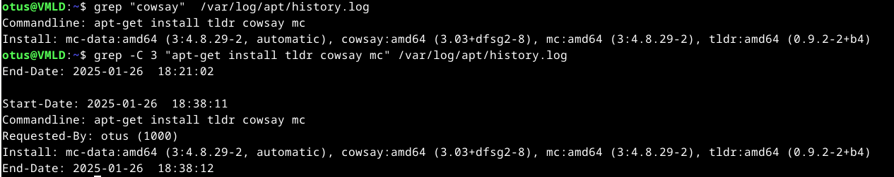
 
 

## e)

Alkuperäisenä tavoitteena oli käyttää yhden tiedoston (cow.txt) sisältöä (yksi rivi tekstiä) grep-kommenon ohjeistuksena toisen tiedoston (aiemmin käytetty history.log) tutkimiseen. Tämän jälkeen grep-komennon ulosanti siirtyisi lehmän suuhun cowsay-ohjelman kautta. Lopullisen tuotoksen oli tämän jälkeen tarkoitus korvata ensimmäisen tiedoston sisältö.

Löysin grepin ohjeista -f valinnan, joka vaikutti hyvältä.

&emsp;*cat cow.txt|grep -f /var/log/apt/history.log*

Komento näytti vain cow.txt -tiedoston sisällön, joten se ei toiminut toivotulla tavalla. Seuraavaksi koitin yksinkertaistaa komentoa poistamalla putken kokonaan ja muokkaamalla grep-komentoa mielestäni loogisella tavalla.

&emsp;*grep -f cow.txt /var/log/apt/history.log*

Tämä käsky toimi odotetulla tavalla ja näytti halutun rivin history.log -tiedostosta. Valitettavasti se tarkoitti myös sitä, että koko putki-idea oli tarpeeton. Halusin kuitenkin yrittää ratkaista ongelman alkuperäisen suunnitelman mukaisesti.

&emsp;*cat cow.txt|grep -f - /var/log/apt/history.log*

Yhden vaivaisen - merkin takia käytin aivan liian kauan aikaa grepin ohjeiden parissa. Ongelma selvisi lopulta lähinnä kokeilemalla eri vaihtoehtoja. En ymmärrä täysin vieläkään, mitä - tarkalleen tekee komennossa.

&emsp;*cat cow.txt|grep -f - /var/log/apt/history.log|cowsay*

Seuraava vaihe onnistui helposti, joten jäljelle jäi vain lehmän ulkoasun hiominen ja alkuperäisen tiedoston sisällön korvaaminen.

&emsp;*cat cow.txt|grep -f - /var/log/apt/history.log|cowsay -e @@ -T U > cow.txt*

Cow.txt tiedoston korvaaminen lehmällä onnistui, mutta jostain syystä lehmän puhekupla tyhjeni toimenpiteen seurauksena. En keksinyt ongelmaan ratkaisua, joten tyydyin sisällön korvaamisen sijaan täydentämään sitä. Lopullisessa cow.txt tiedostossa on siis alkuperäinen sisältö ja cowsay:n tuottama lehmä, joka kertoo meille rivin history.log tiedostosta. Lopullinen komento oli:

&emsp;*cat cow.txt|grep -f - /var/log/apt/history.log|cowsay -e @@ -T U >> cow.txt*

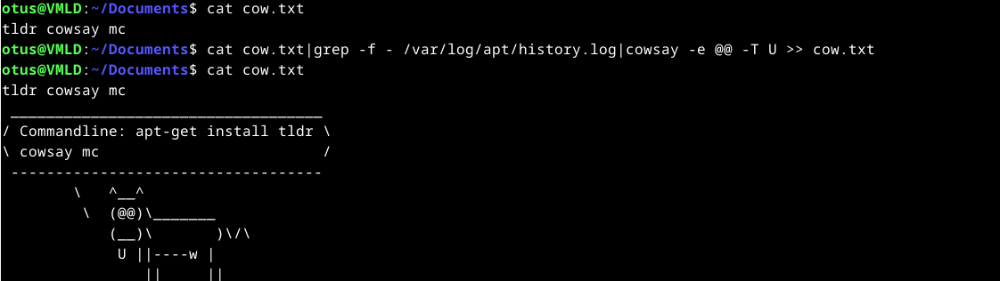
 
 
## f)

Aloitin tehtävän asentamalla lshw-ohjelman. Tämän jälkeen ajoin tehtävänannossa annetun komennon nähdäkseni tietoa virtuaalikoneesta. Komennon -short valinta liittyy ohjeiden mukaan siihen, miten laitepuu tai -polku näytetään. Komennosta löytyvä -sanitaze siistii ulosannista arkaluontoista tietoa, kuten sarjanumeroita.

&emsp;*sudo apt-get install lshw*  
&emsp;*sudo lshw -short -sanitize*

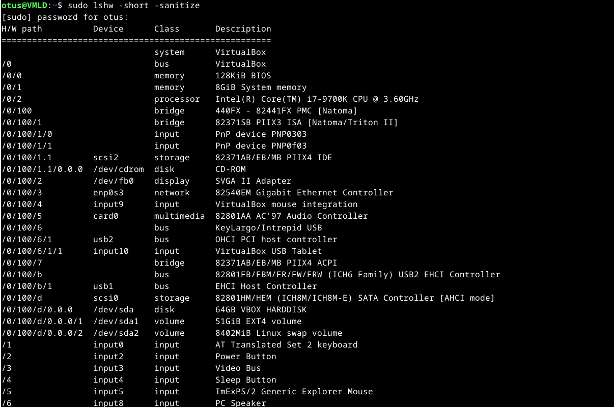
 
 
Ohjelman ulosannissa kiinnitin ensin huomion 'H/W path' -sarakkeeseen. H/W lienee tässä tapauksessa lyhenne hardware-sanasta. Sarake kertoo koneen fyysisten osien hierarkiasta, jossa korkeimmalta (/0) tasolta löytyy tärkeitä komponentteja, kuten keskusmuisti (8GiB System memory) ja CPU (Intel(R) Core(TM) i7-9700K). Seuraavaksi listalla näkyy emolevyn piirisarjaan komponentteja, virtuaalikoneen laitteita ja liitäntöjä.

Ensimmäinen erikoisuus listauksessa on se, että suurin osa komponenteista on VirtualBoxin emuloimia, mutta CPU vastaa isäntäkoneen vastaavaa. Virtuaalikone on ymmärtääkseni täysin riippuvainen isäntäkoneen prosessorista, ja tästä syystä sen osalta ei ehkä voida toteuttaa emulointia. 

Virtuaalikoneen bridge osioista löytyvät 8244FX (northbridge) ja PIIX3 (southbridge) ovat vanhoja piirisarjoja (https://en.wikipedia.org/wiki/Intel_440FX). Sama pätee myös esimerkiksi verkkoadapteriin, 82540EM (https://en.wikipedia.org/wiki/List_of_Intel_codenames), joka ei vastaa isäntäkoneen vastaavaa. Virtuaalikoneen emulointiin on valittu komponentteja luultavasti yhteensopivuuden ja toimintavarmuuden perusteella.

Listauksesta löytyi myös kovalevyyn liittyvää tietoa. VirtualBoxin asetuksissa olin laittanut kovalevyn kooksi 60GB, mutta listauksesta löytyi diskiksi määriteltynä kohta '64GB VBOX HARDDISK'. En tiedä mistä ero johtuu. Kovalevy oli myös jaettuna osioihin '51GiB EXT4 volume' ja '8402MiB Linux swap volume' Näistä ensimmäinen on järjestelmän käytössä oleva tila ja jälkimmäinen on swappia varten (Kovalevyltä varattu tila, jota käytetään muistina, kun järjestelmän keskusmuisti on täynnä). Arvot 51GiB ja 8402MiB vastaavat yhteen laskettua kovalevyn kokonaiskooksi ilmoitettua arvoa (64GB). Swapin arvo 8402MiB on lähellä virtuaalikoneelle annettua keskusmuistia (8GiB), joten nämä ovat luultavasti keskenään sidoksissa VirtualBoxin oletusasetuksissa.

Listauksesta löytyi myös piirisarjan käyttämiä väyliä, mutta en pureudu näihin sen syvällisemmin. Sen lisäksi lista sisältää laitteeseen emuloituja laitteita, kuten hiiri, ja fyysisestä laitteesta normaalisti löytyviä ominaisuuksia, kuten virtanappi ja PC speaker.

## g)

Ajoin ohjeissa annetun komennon hieman muunneltuna saadakseni lokin kaksi viimeistä riviä näkyviin.

&emsp;*sudo journalctl|tail -n 2*

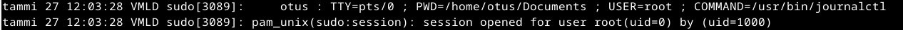
 
 
Löysin lokien viestien tulkitsemiseen aika huonosti tietoa netistä, joten joudun tekemään oletuksia aiempaan kokemukseeni perustuen. Ensimmäinen rivi kertoo käyttäjän suorittamasta komennosta. Rivin voi purkaa osiin suurin piirtein seuraavasti:

Aika ; Koneen nimi ; Sudo-komento [prosessin yksilöivä numero?] ; Käyttäjä ; Miten tai missä komento suoritettiin ; Kotikansio ; Käyttäjällä root oikeudet ; Ajettu ohjelma ja sen polku.

Seuraava rivi liittyi luultavasti käyttäjän oikeuksien väliaikaiseen korottamiseen sudo-komennon seurauksena. Koska sudo[3089] täsmää molemmissa, oletin sen kertovan, että ne liittyvät samaan tapahtumaan.

## f)

Aloitin etsimällä Micron manuaalista plugineihin liittyviä kohtia. Manuaalista löytyi komento, joka listasi tarjolla olevia plugineja. Valitsin listalta tehtävän ohjeissa mainitun Paletteron ja asensin sen. Seuraavaksi hain tietoa pluginin toiminnasta ja päädyin yllättäen (olisihan se pitänyt pluginin nimestä jo arvata) tutun miehen githubiin (https://github.com/terokarvinen/palettero). Ohjeiden tutkimisen jälkeen testasin pluginin toimintaa.

&emsp;*man micro|grep plugin*  
&emsp;*micro -plugin available*  
&emsp;*micro -plugin install palettero*

 
 
Ensimmäinen yritys päättyi epäonnistumiseen. Avasin micron ja koitin ohjelman sisällä ohjelman sivuilla annettua näppäinkomentoa (ctrl+space), mutta mitään ei tapahtunut. Kun palasin takaisin terminaaliin, oli sinne yllättäen ilmestynyt virheilmoitus.

 
 
Päättelin virheilmoituksesta, että minun pitää asentaa myös ilmoituksessa mainittu 'fzf'. Palasin vielä ohjelman sivuille ja luin ohjeet tällä kertaa loppuun asti. Ohjeissa mainittiin selkeästi 'fzf' riippuvuutena ja annettiin komento sen asentamiselle. Asennuksen jälkeen testasin Paletteroa Microssa ja totesin sen toimivaksi. Pluginin käyttötarkoitus on vielä tällä osaamisella hämärän peitossa.

&emsp;*sudo apt-get -y install fzf*

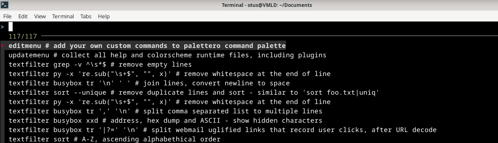
 
 
## Lähteet

Karvinen, Tero 2025: Linux Palvelimet 2025 alkukevät. https://terokarvinen.com/linux-palvelimet/

Karvinen, Tero 2020: Command Line Basics Revisited. https://terokarvinen.com/2020/command-line-basics-revisited/?fromSearch=command%20line%20basics%20revisited

Wikipedia 2023: Intel 440FX. https://en.wikipedia.org/wiki/Intel_440FX

Wikipedia 2025: List of Intel codenames. https://en.wikipedia.org/wiki/List_of_Intel_codenames

Linux.fi 2024: Midnight Commander. https://www.linux.fi/wiki/Midnight_Commander

Karvinen, Tero 2024: palettero. https://github.com/terokarvinen/palettero
 
 
 
 
 
 
 
 
Tätä dokumenttia saa kopioida ja muokata GNU General Public License (versio 2 tai uudempi) mukaisesti. http://www.gnu.org/licenses/gpl.html  
Pohjana Tero Karvinen 2012: Linux kurssi, http://terokarvinen.com

