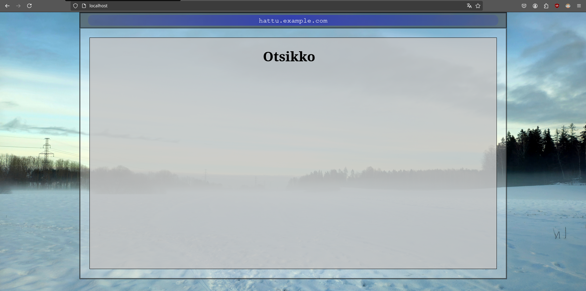

# H3 Hello Web Server

## x)

**Name-based Virtual Host Support**  
(https://httpd.apache.org/docs/2.4/vhosts/name-based.html)

* Name-based Virtual Hosting mahdollistaa useamman palvelimen käytön samassa IP-osoitteessa.
* Apache käsittelee saapuvat yhteydet ensisijaisesti IP-osoitteen ja portin perusteella. Jos samalle IP-osoitteelle on asetettu useampi virtuaalipalvelin, Apache hyödyntää palvelinten ServerName tai ServerAlias asetuksia.
* Palvelimen asetuksissa on oltava vähintään \<VirtualHost> blokki ja sen sisällä ServerName (tarjolla olevan palvelin) ja DocumentRoot (palvelimen sijainti tiedostojärjestelmässä) asetukset.
* ServerAlias asetuksella voi määritellä vaihtoehtoisia nimiä ServerName:n lisäksi. Esimerkiksi ServerName: www.test.com, ServerAlias: test.com.
* Apache:n asetusten lisäksi tulee myös lisätä nimet DNS-palvelimelle.

**Name Based Virtual Hosts on Apache – Multiple Websites to Single IP Address**  
(https://terokarvinen.com/2018/04/10/name-based-virtual-hosts-on-apache-multiple-websites-to-single-ip-address/)

* Ohjeet antavat tarvittavat komennot ja asetustiedostojen sisällöt nimi-pohjaisen palvelimen käyttöönottoon Linux ympäristössä.
* Operaatio aloitetaan asentamalla Apache2 Web Server.
* Seuraavaksi luodaan uusi virtuaalinen palvelin, määrittelemällä sen asetustiedosto, luomalla sille kansio tiedostojärjestelmään ja aktivoimalla se Apachen sites-enabled hakemistoon.
* Ohjeissa kerrotaan myös, kuinka voi ottaa käyttöön useamman virtuaalipalvelimen samassa IP-osoitteessa hosts tiedostoa hyödyntäen.

## Rauta & VirtualBox asetukset

PC: Lenovo L14 Gen 5  
OS: Windows 11 Pro 24H2  
CPU: AMD Ryzen 5 PRO 7535u  
Muisti: 16 GB DDR5-5600MHz  
Storage: 512 GB SSD M.2 2280 PCIe Gen4 TLC Opal  
GPU: Integrated AMD Radeon™ 660M

VirtualBox asetukset:  
Oletusasetukset, muutamia poikkeuksia lukuunottamatta.  
OS: Debian 12.9.0  
Number of CPUs: 2  
Video Memory: 256MB  
Base Memory: 8192MB  
Harddisk: 60GB

## Alkusanat

Tämän raportin aiheena oli Apache2 asennus ja käyttöönotto paikallisesti VirtualBox VM:n päällä pyörivässä Debianissa. Koska itse asennus oli jo tehty aiemmin, raportti keskittyy lähinnä palvelimen oletussivun vaihtoon. Vaihdoin sivun onnistuusti yksinkertaiseen testitiedostoon, jonka korvasin myöhemmin itse tehdyllä HTML5-sivulla. Tehtävissä käytiin läpi myös aiheeseen liittyvää curl-komentoa ja Apachen lokitiedoston tulkintaa. Viimeisessä osiossa selvittelin useamman palvelimen käyttöä yhdessä IP-osoitteessa.

## a)

Asensin Apache2 Web Serverin tuntien aikana. Asennus onnistui hyvin tunnilla saatujen ohjeiden ja tehtävänannossakin mainittujen ohjeiden avulla (https://terokarvinen.com/2018/04/10/name-based-virtual-hosts-on-apache-multiple-websites-to-single-ip-address/). Palvelin ei vaatinut erillistä käynnistämistä, vaan toimi automaattisesti heti asennuksen jälkeen. Vaihdoin tunneilla myös palvelimen aloitussivun, joten curl-komento ei enää hae asennuksen oletussivua.

> &emsp;sudo systemctl status apache2  
> &emsp;curl localhost

 
 
## b)

Tein tehtäviä hieman eri järjestyksessä, joten tässä tehtävässä on jo käytössä c) tehtävässä toteutettu sivujen vaihto. Aloin tutkimaan /var/log/apache2/access.log -tiedostoa. Hieman yllättäen se sisälsi vain vanhoja merkintöjä tuntien aikana tehdyistä kokeiluista. Tarkistin varalta myös other_vhosts_access.log -tiedoston ja löysin tuoreet lokimerkinnät sen sisältä. Ensimmäinen reaktioni oli tarkistaa Apache2 asennuksen oletusasetukset, tarkemmin ottaen sites-available hakemistosta 000-default.conf -tiedosto. Tiedoston sisältä löytyikin kaksi lokeihin liittyvää kohtaa, jotka lisäsin omaan hattu.example.com.conf -tiedostooni.

Muutoksen jälkeen Access.log -tiedostoon tuli selaimella tehdyn yhteydenoton seurauksena kaksi uutta merkintää.

> &emsp;sudo tail -5 /var/log/apache2/access.log

Ensimmäinen lokirivi kertoo onnistuneesta (200) yrityksestä hakea tietoa sivuille määritellystä juuresta. Apache2 tarjoilee oletuksena palvelimen juuresta löytyvän index.html tiedoston. Seuraava rivi kertoo epäonnistuneesta yrityksestä (404, file not found). Haettu favicon.ico on käsittääkseni oletushaku, jonka selaimet tekevät löytääkseen osoiteriville ikonin (https://appwrk.com/resolving-favicon-ico-404-errors). Kyseessä ei ole siis apache2:n asetuksiin liittyvä ongelma.

Löysin avukseni ohjeet (https://httpd.apache.org/docs/2.4/logs.html), joilla tulkitsin lokitiedostoa seuraavasti:

* IP-osoite alussa yksilöi sivuihin yhteyden ottaneen laitteen.
* Ensimmäinen '-' kertoo ettei kohdassa haettavaa tietoa löydy. Tieto olisi liittynyt yhteyden omistajan määrittelyyn Ident-protokollan (https://en.wikipedia.org/wiki/Ident_protocol) avulla. Tieto ei lähteiden perusteella vaikuta luotettavalta tai nykyaikaiselta.
* Seuraava '-' kertoo taas tiedosta, jota ei ole tarjolla. Tässä kohdassa olisi yhteyden ottaneen käyttäjän userid, jolla pyritään tunnistamaan käyttäjä ja tämän oikeus päästä käsiksi haluttuun tietoon.
* Tiedossa on seuraavaksi yhteydenoton aika, päivämäärä ja aikavyöhyke.
* "-merkkien sisältä löytyy tieto siitä, mitä metodia yhteyteen käytetään. Tässä tapauksessa kyseessä on GET (Hakee tietoa, esim. .html ja kuvatiedostoja). Tästä osiosta löytyy myös se mitä haetaan (/ ei tässä tapauksessa ole ymmärtääkseni järjestelmän juuri, vaan Apachen asetuksissa mainittu hakemistojuuri /home/otus/public_sites.hattu.example.com/) ja hakuun käytetty protokolla (HTTP/1.1).
* Tämän jälkeen seuraa kaksi numeroa, joista ensimmäinen kertoo yhteydenoton statuksen. 2-alkuiset numerot kertovat onnistuneesta yhteydenotosta, 3-alkuiset uudelleenohjauksesta, 4-alkuiset virheestä yhteydenottajan päässä ja 5-alkuiset virheestä palvelimen puolella. Toinen numero kertoo lähetetyn datan tavumäärän.
* Seuraava "-merkkien välissä olevan tieto kertoo luultavasti sen mistä yhteys on linkitetty.
* Loppuosio kertoo kokonaisuudessaan yhteydenottoon liittyvistä ohjelmista ja käyttöjärjestelmistä. Omissa lokimerkinnöissäni nämä kertoivat minun käyttäneen Firefoxia Debian-käyttöjärjestelmässä.

## c)

Koska en tiukasta aikarajasta johtuen ottanut ylös tunneilla tehtyjen toimenpiteideiden vaiheita, yritin seuraavaksi päästä toimivaan lopputulokseen tehtävässä annettun hattu.example.com -palvelimen kanssa. Tein alkuun /etc/apache2/sites-available kansioon hattu.example.com.conf tiedoston, johon kopion ja päivitin toimivaksi havaitun sisällön tunnilla tehdystä tiedostosta.

Tämä on tiedoston alkuperäinen sisältö. Lopullinen versio käsiteltiin kohdassa b).

Tämän jälkeen tein hakemiston uutta palvelinta varten ja lisäsin hakemistoon index.html tiedoston, joka sisälsi tekstin hattu.example.com.

> &emsp;mkdir /home/otus/public_sites/hattu.example.com  
> &emsp;echo "hattu.example.com" > /home/otus/public_sites/hattu.example.com/index.html

Seuraavaksi lisäsin uuden palvelimen sites-enabled kansioon aktiiviseksi. Samassa yhteydessä varmistin, että kansiossa ei mitään muuta aktiivisena. Kun sain kansion kuntoon, käynnistin Apachen uudelleen ja testasin uusien asetusten toimintaa. Kaikki toimi odotetulla tavalla.

> &emsp;sudo a2ensite hattu.example.com.conf  
> &emsp;sudo a2dissite test.example.com.conf  
> &emsp;sudo systemctl restart apache2  
> &emsp;curl localhost

## e)

Ajattelin aluksi tehdä vain yksinkertaisimman mahdollisen HTML5-sivun, mutta innostuin kertaamaan myös CSS-perusteita. Tuloksena syntyi aavistuksen tyylitelty, mutta silti yksinkertainen aloitussivu. HTML-osuus tehtävästä meni kivuttomasti, joten siitä ei ole juuri raportoitavaa kuvan lisäksi. CSS aiheutti sitäkin enemmän harmaita hiuksia, mutta se ei varsinaisesti kuulu tehtävänannon piiriin, joten en kommentoi sitä sen tarkemmin. 

 
Ajauduin kuitenkin ongelmiin, kun yritin asettaa sivuja Apachen aloitussivuksi. En tehnyt sivuja virtuaalikoneen sisällä, joten tiedostojen siirtäminen ja käyttäminen eivät olleet niin helppoja kuin ajattelin. Ensimmäinen vaihe oli saada tiedostot virtuaalikoneen sisään. Tähän löysin virtuaalikoneen asetuksista osion Shared folders. Sen kautta oli epäilyttävän yksinkertaista jakaa kansio isäntäkoneelta ohjeiden avulla (https://docs.oracle.com/en/virtualization/virtualbox/6.0/user/sharedfolders.html).

En kuitenkaan osannut laittaa käyttöoikeuksia toimenpiteen aikana kuntoon, joten /media/ hakemistoon mountattu tiedostot sisältävä hakemisto vaati root-oikeuksia. Tiedostojen siirto oikeaan paikkaan sujui sudoa hyödyntäen. Sivut tarjosivat aluksi 'Unable to access' virheilmoituksen. Error.logia tutkimalla löysin virheilmoituksen, joka kertoi hyvin selkeästi ongelman olevan käyttöoikeuksissa.

> &emsp;sudo tail -5 /var/log/apache2/error.log

Menin sivujen hakemistoon, jonka sisältöä tutkimalla kävi heti selväksi, että tiedostot vaativat root-oikeuksia.

> &emsp;ls -l

Ensimmäinen toimenpide oli selvittää, kuinka käyttöoikeuksista vaihdetaan selkein osuus, eli 'root' korvataan arvolla 'otus'. Löysin Google-haulla lähteeksi ohjeet (https://www.redhat.com/en/blog/manage-permissions), joiden avulla muutin käyttäjän ja ryhmän oikeudet rootin sijaan käyttäjälle 'otus'. Suoritin ohjeista selvitetyn komennon kaikille tiedostoille hakemistossa.

> &emsp;sudo chown otus:otus index.html

Tämän toimenpiteen jälkeen selaimen virheilmoitus muuttui forbidden-muotoon. Error.log antoi taas saman käyttöoikeuksiin liittyvän viestin kuin aiemminkin. Koska en tiennyt, minkälaiset oikeudet tiedostoilla pitäisi tarkalleen olla, päätin luoda uuden testitiedoston ilman sudoa. Oletettavasti siinä olevat oikeudet toimisivat myös uusien tiedostojen kanssa, koska olin aiemman testisivunkin saanut toimimaan. Testitiedostosta näki heti, että sen käyttöoikeudet olivat erilaiset sivun tiedostoihin verrattuna. 

Tämän jälkeen selvitin ohjeista, miten muutan käyttöoikeuksia. Ohjeista löytyi kätevä numerojärjestelmä, jonka avulla komento oli helppo muodostaa. Halusin tiedostoille oikeudet -rw-r--r--, kuten testitiedostossa. Käyttöoikeuksista kertova sekava merkkirivi on muodossa, jossa ensimmäinen merkki kertoo onko kyseessä tiedosto vai kansio (- = tiedosto, d = kansio). Loput merkit on jaettu kolmen merkin ryhmiin, jotka ovat järjestyksessä owner, group ja others. Jokaisen ryhmän ensimmäinen merkki r tarkoittaa lukuoikeuksia (read), toinen merkki w tarkoittaa kirjoitusoikeuksia (write) ja kolmas, x, oikeutta ajaa tiedosto (execute). Seuraavaksi selvitin, miten voisin asettaa testitiedoston oikeudet hakemiston muille tiedostoille numerojärjestelmää hyödyntämällä. Järjestelmässä käytetään kolmen numeron koodia. Numeroiden laskeminen tapahtuu siten, että oikeuksille annetaan arvot r = 4, w = 2 ja x = 1 ja - = 0. Sen jälkeen lasketaan yhteen kunkin ryhmän halutut oikeudet. Täydet oikeudet olisivat siis 4+2+1=7 per ryhmä, eli 777 kokonaisuudessaan. Koska halusin oikeudet -rw-r--r--, voidaan ne muuntaa numeroksi 644 (4+2, 4 ja 4). Ajoin seuraavan komennon kaikille tiedostoille. 

> &emsp;chmod 644 index.html

Kaiken tämän jälkeen sivut avautuivat selaimessa. Tajusin myös vasta tässä vaiheessa, että tehtävässä pyydettiin vain tekemään validi HTML5-sivu. Sen asettamista palvelimen oletussivuksi ei pyydetty. No, oppimaanhan tänne on tultu.

## f)

Curlia käytetään manuaalin perusteella kahdensuuntaiseen tiedonsiirtoon palvelinten välillä. Ajattelin ensimmäiseksi yrittää hakea palvelimeltani localhost-osoitteesta aloitussivun sijaan sivun taustakuvan. Yritin ensin komentoa ilman mitään valintoja (curl http:<!-- -->//localhost/background.jpg), mutta sain vastaukseksi varoitusviestin, jossa ei suositeltu käyttämään käskyä näin. Viestissä mainittiin --output valinta, jonka tarkempaan toimintaan perehdyin curlin ohjeista. Testasin komentoa uudessa muodossa ja saavutin toivotun lopputuloksen. Hain siis kuvan palvelimeni sivujen hakemistosta käytössä olleeseen työhakemistoon eri nimellä.

> &emsp;curl --output kuva.jpg http:<!-- -->//localhost/background.jpg

curl-I näyttää yksityiskohtia (response header) suoritettavasta hausta ilman, että hakua varsinaisesti suoritetaan. Esimerkissä hain tiedot tekemiltäni sivuilta.

> &emsp;curl -I localhost

Vastauksesta selviää päivämäärien lisäksi tietoa, kuten palvelintyyppi (server), joka tässä tapauksessa on käyttämämme Debianiin asennettu Apache. Tiedoista löytyy myös haetun tiedon tyyppi (Content-Type), joka on tuloksissa teksti/html. Haettu tieto, eli tässä tapauksessa index.html, on kooltaan (Content-Length) 758 tavua.

## o)

Olin löytänyt hosts tiedoston jo aiemmin tutkiessani /etc/ hakemiston sisältöä, joten säästin huomattavasti aikaa tehtävän tässä vaiheessa. Seuraavaksi loin toisen yksinkertaisen sivun noudattaen aiemmin toimiviksi todettuja keinoja. Tein tarvittavan kansion, loin index.html tiedoston, kopioin hattu.example.com.conf tiedoston nimelle huivi.example.com.conf ja muutin sen sisällöstä oleelliset kohdat. Tämän jälkeen aktivoin sivun ja käynnistin Apachen uudestaan. Kokeilin uteliaisuudesta tässä vaiheessa hakea sivuja localhostin takaa ja sain esiin vain hattu.example.com:in. Seuraavaksi siirryin tutkimaan hosts tiedostoa. En ollut varma mitä sille tulisi tehdä, joten lähdin metsästämään netistä ohjeita. Lopulta löysin esimerkin (https://serverfault.com/questions/288815/howto-use-apache-virtualhost-with-etc-hosts)hyvin yksinkertaiseen muutokseen tiedostossa. Myöhemmin löysin vastaavat muutokset myös tehtävänannossa linkitetyistä ohjeista.

Tallensin tiedon ja koitin sivuja selaimessa ja komentokehotteessa käyttäen localhostin sijaan palvelinten nimiä (hattu.example.com ja huivi.example.com). Kokeilu onnistui. Vaikka poistin localhostin hosts tiedostosta (luultavasti virhe), localhostin takaa löytyy silti hattu.example.com.

> &emsp;curl -I hattu.example.com  
> &emsp;curl -I huivi.example.com

 
 
## Lähteet

Karvinen, Tero 2025: Linux Palvelimet 2025 alkukevät. https://terokarvinen.com/linux-palvelimet/  
Karvinen, Tero 2018: Name Based Virtual Hosts on Apache – Multiple Websites to Single IP Address. https://terokarvinen.com/2018/04/10/name-based-virtual-hosts-on-apache-multiple-websites-to-single-ip-address/  
Apache.org 2025: Name-based Virtual Host Support. https://httpd.apache.org/docs/2.4/vhosts/name-based.html  
Apache.org 2025: Log Files. https://httpd.apache.org/docs/2.4/logs.html  
Wikipedia 2024: Ident protocol. https://en.wikipedia.org/wiki/Ident_protocol  
Oracle.com: Shared Folders. https://docs.oracle.com/en/virtualization/virtualbox/6.0/user/sharedfolders.html  
Redhat.com 2020: How to manage Linux permissions for users, groups, and others. https://www.redhat.com/en/blog/manage-permissions  
Serverfault.com 2011: Howto use Apache virtualHost with etc/hosts. https://serverfault.com/questions/288815/howto-use-apache-virtualhost-with-etc-hosts  
Khanna, Gourav 2024: How to Fix Favicon.ico 404 Errors Like a Pro: Tips and Tricks. https://appwrk.com/resolving-favicon-ico-404-errors)
 
Raportin toimenpiteet suoritettu 2.2.2025.
 
 
 
 
 
 
Tätä dokumenttia saa kopioida ja muokata GNU General Public License (versio 2 tai uudempi) mukaisesti. http://www.gnu.org/licenses/gpl.html  
Pohjana Tero Karvinen 2012: Linux kurssi, http://terokarvinen.com

