# H4 Maailma kuulee
**Raportin toimenpiteet suoritettu 9-10.2.2025*

## x)

**Teoriasta käytäntöön pilvipalvelimen avulla (h4)**  
(https://susannalehto.fi/2022/teoriasta-kaytantoon-pilvipalvelimen-avulla-h4/)

* Raportissa käydään läpi palvelimen (Digital Ocean) ja domainnimen (Namecheap) vuokraaminen hyödyntäen GitHub Education-etuja.
* Sijainniksi palvelimelle valikoituu maantieteellisesti lähin vaihtoehto, Amsterdam.
* Palvelimella valitaan Debian (11 x64) kääyttöjärjestelmä ja sille määritellään 1GB muistia.
* Kirjoittaja valitsee autentikointimenetelmäksi salasanan, koska ei mielestään osaa käyttää SSH-avaimia.
* Palvelimelle suoritetaan käyttöönottoon liittyviä toimenpiteitä, kuten järjestelmän päivittäminen ja palomuurin asennus.
* Palomuurista avataan portit 22 ja 80 (tcp).
* Rapportissa kuvaillaan Apache2-palvelimen asennusta ja sen käyttämistä sivujen julkaisemiseen.
* Sivuiksi tehdään perusluontoiset HTML-sivut.
* Lopuksi kirjoittaja analysoi lokeista löytyvää mahdollista murtautumisyritystä.

**First Steps on a New Virtual Private Server – an Example on DigitalOcean and Ubuntu 16.04 LTS**  
(https://terokarvinen.com/2017/first-steps-on-a-new-virtual-private-server-an-example-on-digitalocean/)

* Hyvät salasanat ovat erittäin tärkeitä.
* Palvelimia on tarjolla monelta yritykseltä, kuten Digital Ocean, Linode ja Gandi.
* Opiskelijoille on tarjolla hyviä etuja Github Educationin kautta.
* Sivulla käydään läpi palvelimella tehtäviä ensimmäisiä toimenpiteitä, kuten uuden käyttäjän luonti, palomuurin asennus ja root-oikeuksien lukitseminen. Myös järjestelmän päivittäminen on huomioitu.
* Sivuilla ohjataan myös hankkimaan Domainnimi. Palveluntarjoajiksi mainitaan Namecheap ja Gandi.
 
## Ajoympäristö

PC: Lenovo L14 Gen 5  
OS: Windows 11 Pro 24H2  
CPU: AMD Ryzen 5 PRO 7535u  
Muisti: 16 GB DDR5-5600MHz  
Storage: 512 GB SSD M.2 2280 PCIe Gen4 TLC Opal  
GPU: Integrated AMD Radeon™ 660M

VirtualBox asetukset:  
Oletusasetukset, muutamia poikkeuksia lukuunottamatta.  
OS: Debian 12.9.0  
Number of CPUs: 2  
Video Memory: 256MB  
Base Memory: 8192MB  
Harddisk: 60GB

VPS:
Digital Ocean Droplet  
OS: Debian 12 x64  
CPU: Shared  
Muisti: 1GB

## Alkusanat

Tämä raportti käsittelee palvelimen vuokraamista julkisilta tarjoajilta. Valitsin käyttöön Digital Oceanin (https://www.digitalocean.com/) lähinnä Githubin etujen takia. Tein palvelimen käyttöönottoon liittyviä toimenpiteitä ja asensin Apache2-palvelimen, joka tarjoaa maailmalle tekemääni alkeellista sivua. Suurimmat ongelmat raportissa esitettyjen toimenpiteiden suorittamisessa liittyivät tiedostojen ja hakemistojen käyttöoikeuksiin. Edellisten viikkojen opeilla selviydyin ongelmista kohtuu nopeasti.

## a)

Aloitin virtuaalipalvelimen vuokraamisen ilmoittautumalla GitHub Educationiin (GitHub Student Developer Pack). Vaikka hakemus hyväksyttiin heti, jouduin odottamaan luvattuja etuja noin neljä päivää. Onneksi tajusin hake niitä hyvissä ajoin. Tarjolla olevista eduista valitsin Digital Oceanin, jolle oli tarjolla 200$ edestä krediittejä vuoden ajaksi.

Tilin luomisen yhteydessä lisäsin vaaditut luottokortin tiedot ja aktivoin GitHub Educationin edun. Sivuston Billing-osiosta löysin luvatut 200$ saldona ja merkinnän Education-paketin käytöstä.

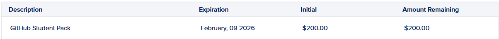

Löysin uusien palvelimien luomisen Create-napin takaa sivun oikeasta yläkulmasta. Palvelimista käytetty Droplet-nimi aiheutti aluksi lievää epävarmuutta, mutta niiden asetussivua tutkimalla totesin ne käyttööni sopiviksi. Aloitin asetusten läpikäymisen palvelimen maantieteellisestä sijainnista. Tarjolla olevista vaihtoehdoista vain kaksi, Amsterdam ja Frankfurt, oli EU-alueella. Näillä on tuskin suurta käytännön eroa, joten valitsin Frankfurtin.

Käyttöjärjestelmäksi tarjolla oli samoja vaihtoehtoja, kuin tunnilla esitellyssä palvelussa. Valitsin käyttöön tutun ja turvallisen Debianin (12 x64). Valitsin palvelimelle halvimman mahdollisen CPU-tyypin (Basic, shared CPU). Huomasin, että halvimmassa palvelimessa oli vain 512MB muistia, joten päädyin ottamaan seuraavaksi halvimman vaihtoehdon, jossa muistia oli 1GB. Hintaa valinnalle tuli 6$. Ei ole riskiä siitä, että GitHubin tarjoama 200$ ylittyy seuraavan vuoden aikana.

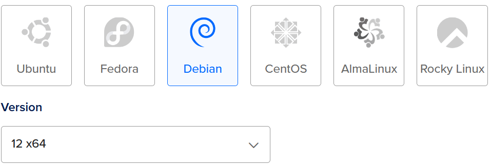
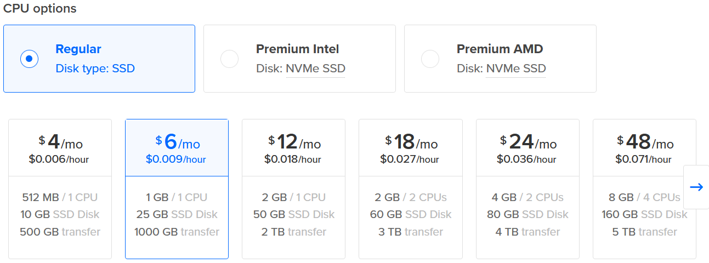

Seuraavaksi tarjolla oli lisää levytilaa ja automaattista varmuuskopiointia pienellä lisämaksulla. Ohitin ne ja siirryin valitsemaan Authentication Metodia. Tunneilla suositeltiin käyttämään SSH-avaimia, joten seuraavaksi siirryin virtuaalikoneeni puolelle asentamaan tarvittavia ohjelmia. Vastoin tunnilla nähtyä esimerkkiä, minulla oli openSSH-client jo valmiiksi asennettuna, joten siirryin luomaan SSH-avaimia.

>&emsp;sudo keygen

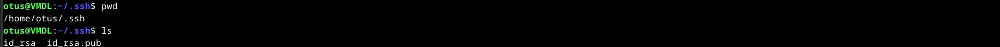

Avaimet luotuani laitoin julkisen avaimen (id_rsa.pub) uuden palvelimen asetuksiin ja annoin sille nimeksi Key1. Lisäasetuksista otin käyttöön IPv6-verkon. Vaihdoin Hostnamen itselleni selkeämpään muotoon ja loin palvelimen Create Droplet-napista first-project-projektiin.

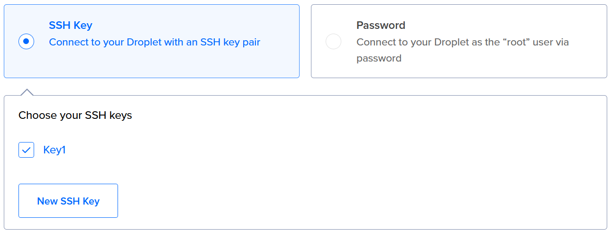
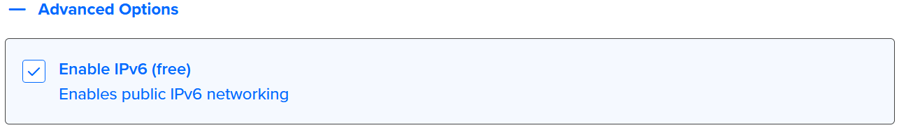

Palvelimen luontiin kului noin minuutti, jonka jälkeen se löytyi first-projectin alta IP-osoitteen kanssa.

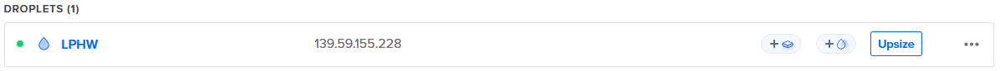

## b)

Aloitin palvelimen käytön ottamalla SSH-yhteyden root-käyttäjänä palvelimelle annettuun IP-osoitteeseen omalta Debian-pohjaiselta virtuaalikoneeltani. Yhteydenotto onnistui ja löysin itseni palvelimen /root/ hakemistosta.

>&emsp;ssh root@IP-osoite

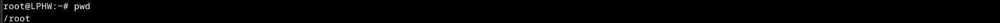

Lähdin tekemään jatkotoimenpiteitä tunneilla tehdyssä järjestyksessä, mutta jälkikäteen ajateltuna olisi ehkä ollut hyvä laittaa palomuuri päälle ja päivitykset kuntoon heti aluksi. Palvelin oli turhaan suojaamatta tovin, kun selvittelin asioita. Ensimmäiseksi loin uuden otus-käyttäjän palvelimelle vahvalla salasanalla. Täytin käyttäjän tiedoista vain nimen. Tämän jälkeen annoin käyttäjälle sudo-oikeudet.

>&emsp;sudo adduser otus  
>&emsp;sudo adduser otus sudo

Seuraavaksi kopioin uudelle käyttäjälle SSH-avaimet /root/.ssh/ kansioista ja vaihdoin niiden käyttöoikeudet vastaamaan käyttäjäänsä.

>&emsp;cp -n -r /root/.ssh /home/otus/  
>&emsp;chown otus:otus /home/otus/.shh -R

Olin käsittääkseni nyt valmis vaihtamaan käyttäjän otukseen. Poistuin palvelimelta ja kokeilin onnistuneesti yhteydenottoa uudella käyttäjänimellä.

>&emsp;exit  
>&emsp;ssh otus@IP-osoite

Muistiinpanoissani oli seuraavana root-tunnusten lukitseminen. Ajoin tunneilla kerrotun lukitsemiskäskyn ja sen jälkeen poistin SSH-avaimet root-käyttäjältä. Testasin SSH-yhteyttä root-käyttäjänä ja epäonnistuin onnistuneesti. Rootilla ei ollut oikeutta päästä palvelimelle.

>&emsp;sudo usermod --lock root  
>&emsp;sudo rm /root/.ssh -r  
>&emsp;exit  
>&emsp;ssh root@IP-osoite

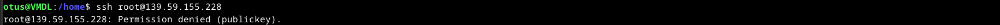

Asensin seuraavaksi UFW-palomuurin ja avasin sille portit SSH-yhteyttä ja tulevaa Apache2-palvelinta varten. Tarkistin porttien avaamiseen käytetyn käskyn ja käynnistin palomuurin. Käynnistämisen jälkeen olin edelleen yhteydessä palvelimeen, joten palomuurin asetukset näyttivät toimivan. Tarkistin asian vielä varalta erikseen.

>&emsp;sudo apt-get update  
>&emsp;sudo apt-get -y install ufw  
>&emsp;sudo ufw allow 22/tcp  
>&emsp;sudo ufw allow 80/tcp  
>&emsp;sudo ufw enable  
>&emsp;sudo ufw status verbose

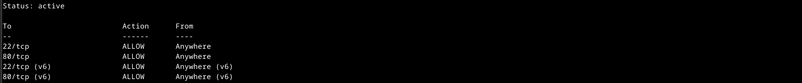

Seuraavaksi ajoin järjestelmään uusimmat päivitykset. Päivityksen yhteydessä sain ilmoituksen SSH:n paikallisesti muokatusta asetustiedostosta, jonka päivitys olisi halunnut korvata uudella. Päädyin pitämään vanhan version tiedostosta, koska tiesin sen varmasti toimivaksi.

>&emsp;sudo apt-get -y dist-upgrade

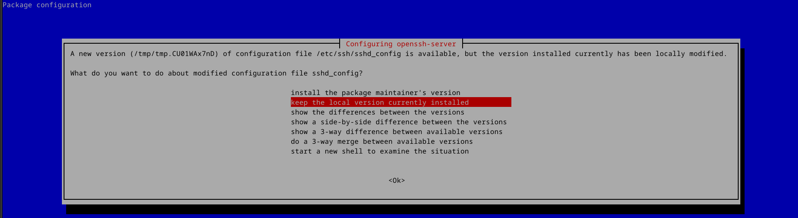

Tässä vaiheessa palvelin olisi varmasti pitänyt käynnistää uudestaan, mutta jostain syystä muistin asian vasta tuntien päästä palatessani tehtävän pariin. En ole täysin varma onko vuokrapalvelimissa mekanismeja, jotka vähentävät uudelleenkäynnistysten tarvetta, mutta päätin kuitenkin käynnistää palvelimen uudestaan Digital Oceanin ohjeiden avulla (https://www.digitalocean.com/community/tutorials/workflow-command-line-basics-shutdown-reboot).
 
>&emsp;sudo reboot

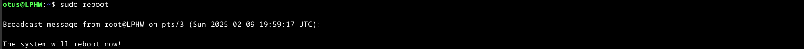

## c)

Aloitin asentamalla Apache2-palvelimen aiemmista tehtävistä tutulla komennolla. Sen jälkeen vaihdoin oletussivun tunneilla annetulla komennolla. Testasin sivua myös selaimella toiselta tietokoneelta onnistuneesti. 

>&emsp;sudo apt-get -y install apache2  
>&emsp;sudo systemctl status apache2  
>&emsp;echo Sivu | sudo tee /var/www/html/index.html  
>&emsp;curl IP-osoite

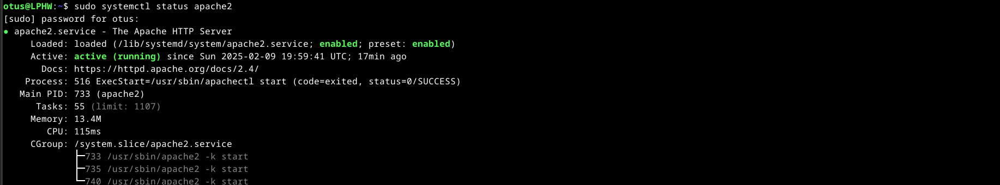 
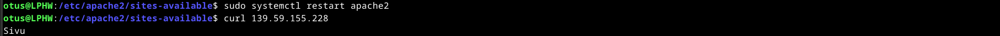 

## d)

Vapaaehtoisessa osiossa päätin laittaa uudelle palvelimelle edellisen viikon tehtävässä paikallisesti tehdyt sivut. Tein ensin public_sites-hakemiston käyttäjän kotikansioon. Tämän jälkeen kopioin hakemistoon palvelimen vaatiman kansion uudella nimellä vanhalta virtuaalikoneeltani. Scp-komento löytyi Aiempien viikkojen kurssimateriaalista (https://terokarvinen.com/2020/command-line-basics-revisited/?fromSearch=command%20line%20basics%20revisited).

>&emsp;mkdir /home/otus/public_sites  
>&emsp;exit  
>&emsp;scp -r /home/otus/public_sites/hattu.example.com otus@IP-osoite:/home/otus/public_sites/sivusto

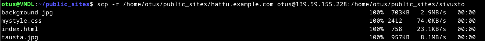

Seuraavaksi loin Apachen sites-available-kansioon uuden sivusto.conf tiedoston, johon kopioin sisällön aiemmin tehdystä hattu.example.com.conf tiedostosta virtuaalikoneeltani. Tein tiedostoon tarvittavat muutokset ja asetin sen aktiiviseksi sites-enabled-kansioon. Samalla poistin käytöstä Apachen oletussivut.

>&emsp;micro sivusto.conf  
>&emsp;sudo a2ensite sivusto.conf  
>&emsp;sudo a2dissite 000-default.conf

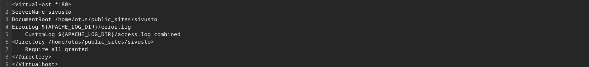

Koitin sivuja selaimen kautta toiselta koneelta, mutta en saanut niihin yhteyttä. Tarkistin merkintöjä Apachen error.logista, joka paljasti mahdolliseksi syyksi käyttöoikeuksien puutteen.

>&emsp;sudo tail /var/log/apache2/error.log

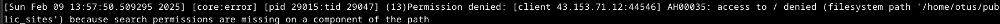

Vertasin virtuaalikoneen toimivan ratkaisun kansioiden ja tiedostojen käyttöoikeuksia palvelimella oleviin ja löysinkin pieniä eroja. En valitettavasti ottanut ylös käyttöoikeuksia ennen muutoksia, mutta annoin /home/otus/public_sites/sivusto/ kansioille luku- ja ajo-oikeudet 'group' ja 'others' ryhmille. Ajoin esimerkin kaltaiset komennot public_sites ja sivusto kansioille, sekä sivujen vaatimille tiedostoille.

>&emsp;sudo chmod 755 /home/otus/public_sites/sivusto  
>&emsp;sudo chmod 644 /home/otus/public_sites/index.html

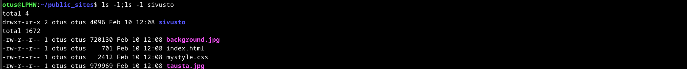

Tämän jälkeen testasin sivuja onnistuneesti toiselta koneelta.

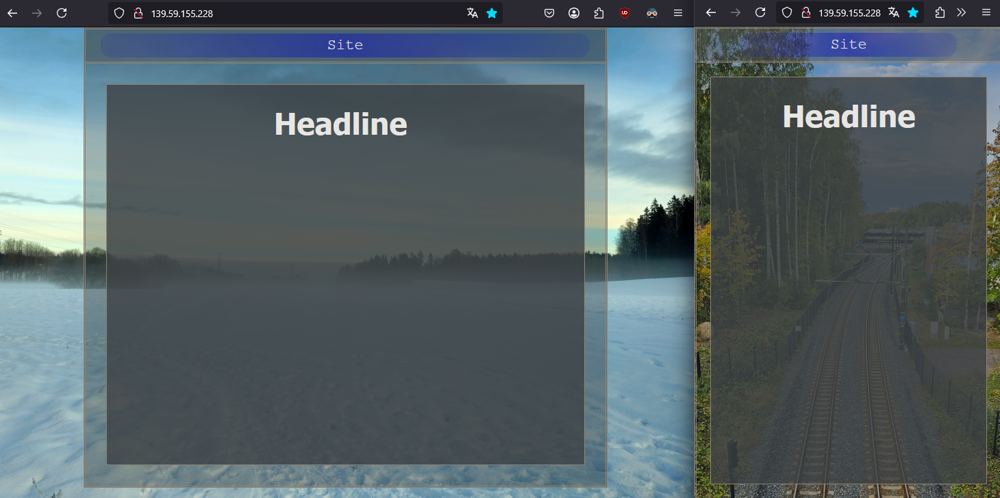
 
 
 
 
## Lähteet

Karvinen, Tero 2025: Linux Palvelimet 2025 alkukevät. https://terokarvinen.com/linux-palvelimet/  
 
Karvinen, Tero 2017: First Steps on a New Virtual Private Server – an Example on DigitalOcean and Ubuntu 16.04 LTS. https://terokarvinen.com/2017/first-steps-on-a-new-virtual-private-server-an-example-on-digitalocean/  
 
Lehto, Susanna 2022: Teoriasta käytäntöön pilvipalvelimen avulla (h4). https://susannalehto.fi/2022/teoriasta-kaytantoon-pilvipalvelimen-avulla-h4/  
 
joshtronic 2019: Command-line Basics: Shutdown and Reboot. https://www.digitalocean.com/community/tutorials/workflow-command-line-basics-shutdown-reboot  
 
Redhat.com 2020: How to manage Linux permissions for users, groups, and others. https://www.redhat.com/en/blog/manage-permissions  
 
Karvinen, Tero 2020: Command Line Basics Revisited. https://terokarvinen.com/2020/command-line-basics-revisited/?fromSearch=command%20line%20basics%20revisited
 
 
 
 
 
 
 
 
 
Tätä dokumenttia saa kopioida ja muokata GNU General Public License (versio 2 tai uudempi) mukaisesti. http://www.gnu.org/licenses/gpl.html
Pohjana Tero Karvinen 2012: Linux kurssi, http://terokarvinen.com

