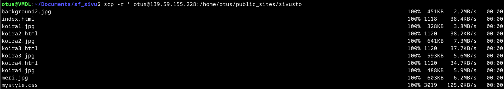

# H5 Nimekäs

Ajoympäristö

PC: Lenovo L14 Gen 5  
OS: Windows 11 Pro 24H2  
CPU: AMD Ryzen 5 PRO 7535u  
Muisti: 16 GB DDR5-5600MHz  
Storage: 512 GB SSD M.2 2280 PCIe Gen4 TLC Opal  
GPU: Integrated AMD Radeon™ 660M

VirtualBox asetukset:  
Oletusasetukset, muutamia poikkeuksia lukuunottamatta.  
OS: Debian 12.9.0  
Number of CPUs: 2  
Video Memory: 256MB  
Base Memory: 8192MB  
Harddisk: 60GB

VPS: Digital Ocean Droplet  
OS: Debian 12 x64  
CPU: Shared  
Muisti: 1GB

Nimipalvelin: Namecheap  
Domain: [koira.me](http://www.koira.me)

## Alkusanat

Tämän viikon tehtävissä oli tarkoitus vuokrata Domain Name sopivalta palveluntarjoajalta, tehdä uuden nimen kautta näkyvät sivut palvelimelle ja perehtyä Host- ja Dig-komentoihin. Valitsin namecheapin lähinnä GitHub Educationin ehdoilla. Koska kyseessä on lähinnä harjoituskäyttöön varattu domain, en ottanut suuria paineita sen nimestä ja löysinkin sopivan vapaana olevan nimen aika nopeasti. Tehtävistä ehkä alkuun epäselvimmät hoituivat hyvin tunnilla otettujen muistiinpanojen ansoista. HTML-sivuihin liittyvät tehtävät olivat osin päällekkäisiä edellisen viikon vapaaehtoisen tehtävän kanssa ja Name Based Virtual Hostin luominen (ainakin näin yksinkertaisena) menee jo kohtuu sujuvasti. Uutena asiana itselleni tuli Host- ja Dig komennot, joiden tutkiminen oli varsin mielenkiintoista.

## a)

*Käsitteitä*  
*A-record: A-record on DNS-tietue, joka kertoo domainin takaa löytyvän IPv4-osoitteen.* ([cloudflare.com](https://www.cloudflare.com/learning/dns/dns-records/))  
*whois: Whois on julkinen tietokanta, johon kerätään tietoa domainien omistuksista, ja josta voidaan hakea tietoa whois-työkaluilla.* ([domain.com](https://www.domain.com/blog/what-is-whois-and-how-is-it-used/))

### GitHub Education

Päätin hyödyntää tehtävässä GitHub education-pakettia, jonka kautta on mahdollista saada NameCheapin .me-domain vuodeksi käyttöön ilmaiseksi. Etupaketin aktivointi onnistui hyvin, mutta laitoin alkuasetuksissa vahingossa nimen osoittamaan GitHub Pages-sivuille. Tämä aiheutti lievää sekaannusta myöhemmin. Koska tuleva domain on tarkoitettu lähinnä koulutehtäviä varten, en valinnut nimeksi mitään henkilökohtaista tai ammattimaista. Yllätyksekseni koira.me oli vapaana, joten koirien ystävänä päädyin siihen.

### Nimipalvelin

Lähdin seuraamaan tunneilla tekemiäni muistiinpanoja ja löysin NameCheapin sivuilta Account-painikkeen alta listan käytössäni olevista domaineista (Domain list).

 
 
Seuraavaksi siirryin uuden nimeni Manage-napin kautta asetusvalikkoon. Asetusten Domain-välilehdellä tajusin, että kaikki palveluun syöttämäni tiedot ovat periaatteessa julkisia. Lähtökohtaisesti kuka tahansa pääsee käsiksi nimipalvelimelle annettuihin henkilötietoihin, kuten nimi, osoite ja puhelinnumero. Kyseessä on nimien hallinnointiin liittyvä vaatimus. Tiedot löytyvät esimerkiksi whois-komennolla Linuxin komentokehotteesta.

>&emsp;whois haaga-helia.fi

 
 
Joillain nimipalvelimilla on kuitenkin käytössä tiedot piilottava ominaisuus. NameCheapilla löytyy asetuksista WithHeldForPrivacy, joka on onneksi oletuksena päällä. Suojauksen seurauksena whois-komento ei enää tarjoa hyödyllistä tietoa domainin omistajasta.

>&emsp;whois koira.me

 
 
Seuraavaksi siirryin asetusten Advanced DNS-välilehdelle. Ensimmäiseksi huomioni kiinnittyi tunneilla nähdystä esimerkistä poikkeaviin recordeihin. Näissä oli kyse aiemmin tekemästäni valinnasta GitHub-sivuihin liittyen. Käytännössä uusi nimeni, koira.me, ohjautui nyt oletuksena tiliini linkitettyihin GitHub-sivuihin. Lisäsin uudet A-recordit osoittamaan palvelimelleni ja poistin kaikki muut. Samalla poistin myös GitHubin-sivujen asetuksista Custom Domain-maininnan.

 
 
Testasin sivuja sekä koira.com, että www<!-- -->.koira.com osoitteilla onnistuneesti.

## b)

Minulla oli jo IP-osoitteen takaa löytyvä Name Based Virtual Host palvelimella edellisen viikon tehtävien seurauksena. Edellisessä tehtävässä toteutettu nimipalvelimen ohjaaminen palvelimeni IP-osoitteeseen johti siis tässä tehtävässä toivottuun lopputulokseen, eli koira.me takaa löytyviin ja tavallisena käyttäjänä muokattavissa oleviin sivuihin. Kertauksena voidaan sanoa, että loin /home/otus/public_sites/sivusto kansion, lisäsin sinne sivujen vaatimat tiedostot, tein uuden .conf tiedoston hostia varten /etc/apache2/sites-available-kansioon, aktivoin uuden tiedoston /etc/apache2/sites-enabled-kansioon ja disabloin apache2:n oletussivut. Tämän jälkeen käynnistin Apache2 uudelleen. Tarkemmat tiedot löytyvät edellisen viikon raportista kohdasta d) ([H4 - Maailma Kuulee](https://github.com/zam-1/linux-course/blob/main/H4/h4-Maailma-kuulee.md)).

## c)

### Sivujen teko

Minulla oli jo toimiva sivu, joten päädyin vain muokkaamaan sitä uuden nimen koirateeman mukaan. Lisäsin sivuille muutamia koiran kuvia erillisille sivuille (index.html, koira1.html jne.). Linkitys tapahtuu thumbnail-tyylisistä kuvista pääkuvan alta. Aloitin sivujen tekemisen VS coden avulla poistamalla vanhasta index.html tiedostosta kaiken turhan. Tämän jälkeen lisäsin siihen pääkuvan ja sen alle loput kuvat pienemmässä koossa. Kun sain tämän vaiheen toimimaan (div elementtien asemointi on tuskaa...), lisäsin pienempiin kuviin linkit alasivuille. Alasivut tein kopioimalla index.html:n ja tekemällä tarvittavat muutokset uusiin tiedostoihin. Lopputulos oli tyydyttävä, vaikka en saanutkaan pikkukuvia riviin kännykkänäkymässä. Annoin alta löytyvän koodin validaattorille, joka ei löytänyt virheitä.

### Sivut palvelimelle

Seuraavaksi lähdin siirtämään sivujen tiedostoja palvelimelle. Tein tämän hyödyntäen edellisten viikkojen tehtävissä käyttämääni Shared Folders-ominaisuutta VirtualBoxin asetuksissa. Jaettavaksi määritelty kansio ilmestyy /media/sf_sivut/-hakemistoon.

 
 
Kopioin hakemiston käyttäjäni kotihakemiston Documents-kansioon helpompaa käsittelyä varten ja muutin sen ja sen sisältämien tiedostojen käyttöoikeudet haluamaani muotoon.

>&emsp;sudo cp -r sf_sivut /home/otus/Documents  
>&emsp;cd /home/otus/Documents  
>&emsp;sudo chown otus:otus sf_sivut  
>&emsp;cd sf_sivut  
>&emsp;sudo chown otus:otus *  
>&emsp;sudo chmod 644 *

 
 
Nyt minulla oli tallessa paikallisesti käyttäjän muokattavissa olevat tiedostot ja olin valmis siirtämään ne palvelimelle. Käytin taas aiemmista tehtävistä tuttua scp-komentoa. Nyt palvelimeltani löytyi kaikki tarvittavat tiedostot oikeasta paikasta, /home/otus/public_sites/sivusto/-hakemistosta. Tiedostot ovat otus-käyttäjän muokattavissa.

>&emsp;scp -r * otus@IP-osoite:/home/otus/public_sites/sivusto

 
 
Seuraavaksi testasin sivut onnistuneesti koira.me ja www<!-- -->.koira.me osoitteilla sekä työpöydällä ja puhelinnäkymässä.

## d)

*Käsitteitä*  
*CNAME: DNS-tietue, joka yhdistää kaksi domainia toisiinsa. Ei voida liittää IP-osoitteeseen (vrt. A-record).* ([cloudflare.com](https://www.cloudflare.com/learning/dns/dns-records/))  
*Alidomain: Mahdollistaa päädomainin laajentamisen. Käytetään nimipalvelimeen liittyvien palveluiden ryhmittelyssä tai vaikka useamman Name Based Virtual Hostin luomisessa.* ([namecheap.com](https://www.namecheap.com/support/knowledgebase/article.aspx/9776/2237/how-to-create-a-subdomain-for-my-domain/))

### Alidomainit

Aloitin alidomainien tutkimisen googlehaulla ja löysin NameCheapin omat ohjeet alidomainien luomiselle ([NameCheap.com](https://www.namecheap.com/support/knowledgebase/article.aspx/9776/2237/how-to-create-a-subdomain-for-my-domain/)). Loin ensin pieni-alidomainin A-recordilla tehtävässä a) kuvatulla tavalla ja sen jälkeen CNAME-recordilla iso-alidomainin. Tähän alidomainiin ei kelvannut isännäksi IP-osoite, joten käytin sen tilalla domainnimeä. Apua löytyi internetistä ([dnsmadeeasy.com](https://dnsmadeeasy.com/post/cname-records-explained)), josta selvisi ettei CNAME:n pitää aina osoittaa toiseen domainiin, ei IP-osoitteeseen.

### Uusi Name Based Virtual Host

Vapaaehtoisessa osiossa lähdin tekemään omaa Name Based Virtual Hostia iso.koira.me alidomainille. Päättelin aluksi, että minun pitää luoda uusi nimipalvelin (iso.koira.me) aiempien oppien mukaisesti ja muuttaa alkuperäisen sivun .conf tiedostoa tottelemaan koira.me:n lisäksi myös pieni- ja www-alidomaineja. Aloitin luomalla uudelle hostille kansion vanhan sivuston rinnalle. Uuteen kansioon tein yksinkertaisen index.html tiedoston, jonka tehtävän oli näyttää vain yksi kuva. Kuvan kopioin alkuperäisen sivuston tiedostoista.

 
 
Tämän jälkeen kopioin /etc/apache2/sites-available/-kansioon uuden isosivusto.conf tiedoston pääsivun sivusto.conf-tiedostosta. Tein uuteen tiedostoon muutokset, jotka viittaavat uuteen iso.koira.me-alidomainiin. Oleellisia kohtia olivat ServerName ja hakemistot.

 
 
Seuraavaksi muutin alkuperäisen sivusto.conf-tiedoston osoittamaan koira.me:n lisäksi myös muihin alidomaineihin. ServerNamen muutosten lisäksi otin käyttöön myös ServerAlias ominaisuuden, jonka alle listasin tarvittavat alidomainit.

 
 
Asetusten muuttamisen jälkeen jäljellä oli enää uuden hostin aktivointi ja Apache2:n resetointi.

>&emsp;sudo a2ensite isosivusto.conf  
>&emsp;sudo systemctl restart apache2

Kaiken tämän jälkeen, minulla oli pääsivu, joka totteli nimiä koira.me, www<!-- -->.koira.me ja pieni.koira.me. Sen lisäksi minulla oli toinen Name Based Virtual Host, joka totteli ainoastaan nimeä iso.koira.me.

## e)

*Käsitteitä*  
*Host: Komentorivin työkalu, jolla voidaan hakea IP-osoitetta hostnamella, tai päinvastoin.* ([phoenixnap.com](https://phoenixnap.com/kb/linux-host))  
*Dig: Komentorivin työkalu, jolla voidaan kerätä DNS-tietoa kohteesta, kuten domain tai IP-osoite.* ([phoenixnap.com](https://phoenixnap.com/kb/linux-dig-command-examples))

## Host

>&emsp;host iso.koira.me

Host komento omaan alidomainiini kertoo sen olevan alias päädomainille koira.me. Hausta selviää myös nimen takana vaikuttava IP-osoite, joka on sama kuin käytössä olevalla palvelimella. En ole muuttanut nimipalvelimeni sähköpostiasetuksia, mutta niiden oletusarvot ja host-komennon ulosanti vastaavat toisiaan. Asetuksissa määritelty sillisalaatti kertoo luultavasti oleelliset tiedot käytössä olevasta edelleenlähetyspalvelusta.

 
 
>&emsp;host bta3062.com

Kyseessä on Battletech-pelin modin sivusto. Tarjolla olevista lyhyistä tiedoista selviää domainin takana olevan palvelimen IP-osoite ja postin edelleenlähettämiseen liittyvät tiedot. Pieni projektisivusto tulee ilmeisesti toimeen pienemmällä postinkäsittelykapasiteetilla kuin suuri nimipalvelin.

 
 
>&emsp;host hs.fi

Helsingin Sanomien palvelimesta irtoaa muista poiketen useita osoitteita. IPv4-osotteita on peräti 4. Sen lisäksi hs.fi hyödyntää myös useampaa IPv6-osotteita. Postin käsittelyssä luotetaan Microsoftin tarjontaan, Outlook:ia hyödyntäen.

### Dig

Dig-komentoa ei löytynyt oletuksena omalta palvelimeltani, joten jouduin ensin selvittämään, miten sen saa asennettua. Asia selvisi Googlen avulla nopeasti ([cloudns.net](https://www.cloudns.net/blog/linux-dig-command-install-use/)).

>&emsp;sudo apt-get -y update  
>&emsp;sudo apt-get -y install dnsutils

Seuraavaksi lähdin kokeilemaan komentoa omaan palvelimeeni.

>&emsp;dig koira.me

 
 
* Internetistä löydettyjen tietojen ([phoenixnap.com](https://phoenixnap.com/kb/linux-dig-command-examples)) avulla, lähdin tulkitsemaan Dig-komennon ulosantia. Ensimmäinen rivi kertoo haussa käytetyn ohjelmaversion ja haun kohteen.
* Header-osiosta selviää tietoa tehdystä hausta. Se kertoo haun tyypin (query) ja miten se meni (NOERROR, onnistunut haku). Se sisältää myös haun attribuutteja, jotka kertovat tässä tapauksessa siitä, että kyseessä oli vastaus (qr) ja sen, että haku halusi (rd) tietoa rekursiivisesti. (ra) kertoo sen, että palvelimen on mahdollista toteuttaa rekursiivinen haku. Loppuosa kertoo vastauksen sisällöstä.
* OPT PSEUDOSECTION-kertoo EDNS (Extension system for DNS) version, haun lisäasetuksia (joita tässä haussa ei ole) ja käytetyn portin. ENDS mahdollistaa suuremmat tiedostokoot vastauksissa ja perus-DNS laajemman työkalupakin.
* QUESTION ja ANSWER SECTION kertovat yhdessä sen mitä haetaan, ja mitä hakuun vastataan. Tässä tapauksessa haetaan tietoa koira.me-domainin A-record (A) tietoja internetissä (IN). Vastauksessa haettu tieto löytyy palvelimen IP-osoitteen muodossa.
* Loppuosa kertoo DNS-palvelimesta, josta tietoa kysyttiin. Tiedot ovat hakuun kulunut aika, palvelimen osoite, haun ajankohta ja vastauksen koko.

>&emsp;dig bta3062.com

Tässä haussa ei ole juurikaan eroa edelliseen. Osoitteissa ja porteissa on luonnollisesti eroja, mutta vastaus on sisällöltään muuten sama.

>&emsp;dig hs.fi

 
 
HS.fi:n tiedot eroavat lähinnä IP-osoitteiden määrässä. Käytössä on jo HOST-komennosta tutut neljä osoitetta. Dig ei ilmeisesti oletuksena näytä IPv6-osotteita.

### Kaivetaan syvemmälle

Ensimmäiseksi lähden perehtymään siihen, mitä eri tietoja Dig-komennolla saa kaivettua esiin. Löysin avuksi sivut ([cyberciti.biz](https://www.cyberciti.biz/faq/linux-unix-dig-command-examples-usage-syntax/)) internetissä, joilla listataan haettavia tyyppejä. Koitin muutamia haettavia tyyppejä, kuten AAAA (IPv6), NS (NameServer-nimi) ja MX (Email-palvelimien host-nimet).

>&emsp;dig hs.fi AAAA  
>&emsp;dig hs.fi NS  
>&emsp;dig hs.fi MX

 
 
Mielenkiintoisin huomio yllä olevista tiedoista on se, että hs.fi käyttää Amazonin nimipalvelimia (esim. ns-1461.awsdns-54.org). Tarjolla on muitakin haettavia tyyppejä, mutta laitan niistä enää vain esimerkin CNAME-recordista, jota oma domainini iso.koira.me edustaa. Hausta selviää lähinnä juuridomain, eli koira.me.

>&emsp;dig iso.koira.me CNAME

## f)

*Käsitteet*  
*SPF: Sender Policy Framework on tietuetyyppi, joka liittyy yleensä sähköpostien varmentamiseen ja sisältää IP-osoitteet, jotka saavat lähettää postia domainilta* ([cloudflare.com](https://www.cloudflare.com/learning/dns/dns-records/dns-spf-record/))  
*DMARC: Domain-based Message Authentication Reporting And Conformance on SPF:n kanssa yhteistyössä toimiva metodi, joka pyrkii todentamaan sähköpostin ja estämään sähköpostidomainien väärinkäytön.* ([cloudflare.com](https://www.cloudflare.com/learning/dns/dns-records/dns-dmarc-record/))

### SPF

Kun aiemmissa tehtävissä tutkin oman nimipalvelimeni sähköpostiasetuksia, huomasin tarjolla olevan SPF-rimpsun olevan TXT-Record. Tämän perusteella arvasin seuraavan komennon ja kohdistin sen taas Helsingin Sanomiin. Vastauksesta löytyi tutun näköinen tekstinpätkä.

>&emsp;dig hs.fi TXT

Vastauksen tulkitsemiseen löysin avukseni cloudflaren artikkelin ([cloudflare.com](https://www.cloudflare.com/learning/dns/dns-records/dns-spf-record/)).

* v=spf1 kertoo kyseessä olevan SPF-tietue. Löytyy aina niiden alusta.
* IP-osoitteet (tai tässä tapauksessa IP-osoite avaruudet) kertovat osoitteet, joilla on oikeus lähettää postia domainin puolesta.
* Includen takaa löytyvät osoitteet ovat kolmansien osapuolien domaineja (ja niiden IP-osoitteita), joilla on myös oikeus viestien lähettämiseen.
* -all kertoo sen, että kaikkien muiden kuin aiemmin sallittujen osoitteiden lähettämät viestit hylätään.

### DMARC

## Lähteet
Karvinen, Tero 2025: Linux Palvelimet 2025 alkukevät. https://terokarvinen.com/linux-palvelimet/  
Zam-1 2025: H4 Maailma kuulee. https://github.com/zam-1/linux-course/blob/main/H4/h4-Maailma-kuulee.md  
namecheap.com 2024: How to Create a Subdomain for my Domain. https://www.namecheap.com/support/knowledgebase/article.aspx/9776/2237/how-to-create-a-subdomain-for-my-domain/  
Oliver, Heather: CNAME Records Explained. https://dnsmadeeasy.com/post/cname-records-explained  
Pramatarov, Martin 2025: Linux dig command, how to install it and use it. https://www.cloudns.net/blog/linux-dig-command-install-use/  
Zivanov, Sara 2024: dig Command in Linux with Examples. https://phoenixnap.com/kb/linux-dig-command-examples  
Zivanov, Sara 2023: Linux host Command wwith Examples. https://phoenixnap.com/kb/linux-host  
Gite, Vivek 2024: Linux and Unix dig Command Examples. https://www.cyberciti.biz/faq/linux-unix-dig-command-examples-usage-syntax/  
cloudflare.com: What is a DNS record?. https://www.cloudflare.com/learning/dns/dns-records/  
cloudflare.com: What is a DNS SPF record?. https://www.cloudflare.com/learning/dns/dns-records/dns-spf-record/
cloudflare.com: What is a DNS DMARC record?. https://www.cloudflare.com/learning/dns/dns-records/dns-dmarc-record/  
domain.com 2024: What is WHOIS and How to Look UP a Domain. https://www.domain.com/blog/what-is-whois-and-how-is-it-used/  
https://validator.w3.org

 
 
 
 
 
 
 
 
 
Tätä dokumenttia saa kopioida ja muokata GNU General Public License (versio 2 tai uudempi) mukaisesti. http://www.gnu.org/licenses/gpl.html
Pohjana Tero Karvinen 2012: Linux kurssi, http://terokarvinen.com

