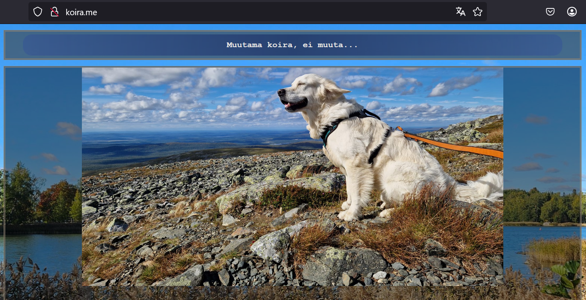
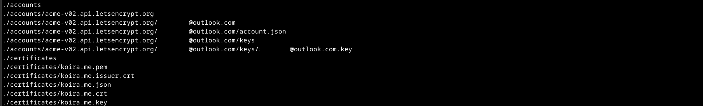
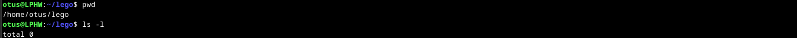
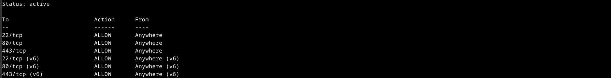
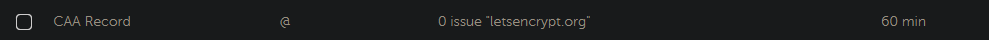

# H6 Salataampa

## x)

### Let's Encrypt 2024 ([letsencrypt.org](https://letsencrypt.org/how-it-works/))

* Artikkelissa kerotaan, miten certifikaatti otetaan käyttöön ja kuinka se pidetään päivitettynä.
* Varmistus tapahtuu avainparilla, joka luodaan sertifikaatin luonnin yhteydessä.
* Sertifikaatin hakuun käytetty ohjelma kommunikoi Let's Encryptin palvelinten kanssa ja varmistaa HTTP tai DNS menetelmin, sen että hakija hallitsee palvelinta.
* Sertifikaatin uusiminen tapahtuu avainparin avulla.
  
### Lange 2024: Lego: Obtain a Certificate ([go-acme.github.io](https://go-acme.github.io/lego/usage/cli/obtain-a-certificate/index.html#using-an-existing-running-web-server))

* Tekstissä kerrotaan se, miten sertifikaatti hankitaan olemassa olevalle palvelimelle.
* Komentonta käytetään rakennetta: lego --accept-tos --email you<!-- -->@example.com --http --http.webroot /path/to/webroot --domains example.com run.
* --http kertoo käytetyn varmistusmenetelmän ja --http.webroot taas kohdesivuston julkisen hakemiston juuren.

### Apache HTTP Server Version 2.4 Documentation: SSL/TLS Strong Encryption: How-To ([apache.org](https://httpd.apache.org/docs/2.4/ssl/ssl_howto.html#configexample))

## a)

Ensimmäiseksi totesin, että sivut toimivat käynnistämällä palvelimen uudelleen ja kokeilemalla sivuja selaimessa. Sivujen vaikuttivat toimivan normaalisti, joten siirryin tehtävässä eteenpäin.

>sudo systemctl restart apache2




### Testisertifikaatit

Aloitin asentamalla Legon, jolla on tarkoitus hakea sertificaatit salausta varten Let's Encrypt-palvelun kautta. Testasin Legoa ensin sen testiympäristössä, jonka osoitteen hain Let's Encryptin sivuilta ([letsencrypt.org](https://letsencrypt.org/fi/docs/staging-environment/)).


<br />
<br />
Loin /home/otus/Lego-kansion ja ajoin seuraavan komennon sertifikaatin hakemiseksi Let's Encryptin testipalvelimelta. Testaaminen kannattaa, koska Let's Encrypt ei arvosta epäonnistuineita yrityksiä oikeilta palvelimilta. Virheellisistä komennoista saattaa seurata odottelua bannin muodossa. Tarkistin komennon jälkeen, että uudesta kansioista löytyi sertifikaatin tiedostot.
 
>lego --server=https:<!-- -->//acme-staging-v02.api.letsencrypt.org/directory  
>--accept-tos --email=nimi<!-- -->@outlook.com  
>--domains=koira.me --domains=www<!-- -->.koira.me  
>--http --http.webroot='/home/otus/public_sites/sivusto' --path='/home/otus/lego'  
>--pem run




### Oikeat sertifikaatit

Koska testi onnistui, muutin testissä käytetyn lego-kansion nimen ja loin uuden /home/otus/lego-kansion oikeita sertifikaatteja varten. Tarkistin kansion ja totesin sen olevan tyhjä ja valmis käyttöön.


<br />
<br />
Lähdin hakemaan oikeita sertifikaatteja sivustolleni /home/otus/lego-kansioon. Käytin samaa komentoa kuin aiemmin, mutta muutin sitä tunnilla läpi käytyjen ohjeiden mukaan. Poistin ajetusta komennosta viittauksen testiympäristön palvelimeen. Komennon jälkeen tarkistin taas, että tiedostot oli luotu oikein lego-kansioon.

>lego --accept-tos --email=email<!-- -->@outlook.com  
>--domains=koira.me --domains=www<!-- -->.koira.me  
>--http --http.webroot='/home/otus/public_sites/sivusto' --path='/home/otus/lego'  
>--pem run


### Apache2-asetukset

Lähden tekemään muutoksia palvelimen asetustiedostoon, /etc/apache2/sites-available/sivusto.conf, tunnilla tehtyjen muistiinpanojen ja tehtävänannon ohjeiden perusteella. Kopioin tiedostoon toisen virtualhostin ja muutin sen portin salatun liikenteen oletusporttiin 443. Sen jälkeen lisäsin tämän uuden virtualhostin alle rivit jotka mahdollistavat salauksen käytön (SSLEngine On) ja määrittelevät sertifikaattiin liittyvät hakemistopolut.

sudoedit /etc/apache2/sites-available/sivusto.conf


<br />
<br />
Seuraavaksi aktivoin Apache2-palvelimen SSL ominaisuudet a2enmod-komennolla. Tämän jälkeen käynnistin palvelimen uudestaan ja ajoin asetusten testikomennon, joka antoi vastaukseksi lyhyesti ja ytimekkäästi 'Syntax OK'. Jäljellä oli enää palomuurin käsittely. Avasin palomuurista portin 443 ja tarkistin vielä palomuurin toiminnan ja säännöt.

>sudo a2enmod ssl  
>sudo systemctl apache2 restart  
>sudo apache2ctl configtest  
>sudo ufw allow 443/tcp  
>sudo ufw status



### Salauksen testaaminen

Kokeilin sivuja selaimessa ja petyin pahasti. Salaus ei näyttänyt toimivan toivotulla tavalla. Sekä koira<!-- -->.me, että www<!-- -->.koira.me kertoivat salauksen puuttuvan. Kokeilin sivuja kolmella eri laittella huonoin tuloksin.

>koira<!-- -->.me  
>www<!-- -->.koira.me


<br />
<br />
Kokeilin kuitenkin varalta pakottaa selaimen hakemaan salattua versiota lisäämällä osoitteen alkuun https:/. Hieman yllättäen salaus näytti tämän perusteella toimivan, mutta sivut eivät jostain syystä halua ladata salattuja sivuja oletuksena. Koitin uudestaan kolmella eri laitteella, myös sellaisella jolla sivuja ei ollut aiemmin käytetty. Tuloksets olivat samanlaisia. Jälkikäteen ajatellen saatoin olla tässä kohtaa välimuistin uhri. Vaikka koitin sivuja useammalla laittella, olin käynyt niillä sivuillani aiemmin.

>https:<!-- -->//www<!-- -->.koira.me


<br />
<br />
Etsin Googlella apua siihen, miten saisin ohjattua kaikki porttiin 80 tulevat haut porttiin 443. Löysin hetken etsimisen jälkeen palvelimen .conf tiedostoon lisättävän Redirect ominaisuuden. Lisäsin sen salaamattoman (port 80) virtualhostin alle Apache2-dokumentaatiosta löydetyillä ohjeilla ([apache2.org](https://httpd.apache.org/docs/2.4/rewrite/remapping.html)). Tämän muutoksen jälkeen sivut vaikuttavat toimivan salattuina oletuksena.


### Sertifikaatin uusiminen ja Cron

Aloitin sertifikaattien uusimisen ajastettuna tutkimalla Cronia. Tiesin etukäteen, että Cron on tarkoitettu komentojen ja toimintojen ajastamiseen, mutta en tuntenut sen yksityiskohtia. Koitin ensin kokeilemalla Cron-komentoa, jota ei löytynyt järjestelmästä. Tiesin kuitenkin, että Cron on olemassa, koska olin nähnyt merkkejä sen toiminnasta aiemmin lokitiedoista. Seuraavaksi testasin onko Cron toiminnassa tarkistamalla sen statuksen ja totesin olevan käynnissä taustalla.

>sudo systemctl status cron


<br />
<br />
Seuraavaksi koitin löytyykö järjestelmästä croniin liittyviä käskyjä syöttämällä komentokehoitteeseen 'cron' ja painamalla tabulaattoria. Tunsin oloni voittajaksi, kun ruudulle ilmestyi crontab-komento. Tutkin löytyneen komennon --help tietoja ja totesin ne poikkeuksellisen yksinkertaisiksi. Kuten allaolevasta kuvasta näkyy, annettu komento oli väärä, mutta johti silti oikeaan lopputulokseen. Oikea komento olisi ollut 'crontab -h'.

>crontab --help


<br />
<br />
Koitin seuraavaksi ohjeista löytynyttä komentoa, joka mahdollistaa käyttäjän crontabin muokkaamisen. Ohjelma jatkoi edelleen helppokäyttöisenä ja eteeni aukesivat selkeät ohjeet tehtävien ajoittamiseen ja paikka, johon ne lisätään. Syötin ohjeiden alle rivin, jonka tarkoituksena oli luoda hetken päästä uusi test.txt tiedosto ja sen sisälle tekstiä. Muutaman minuutin odottelun jälkeen tekstitiedosto ilmestyi määriteltyyn kansioon kello 10:07. Tarkistin myös journalctl:sta, että komento oli ajettu. Crontabin ajastus noudattaa muotoa 'minuutti tunti kuukauden-päivä kuukausi viikonpäivä'.  Merkki * tarkoittaa mitä tahansa (any).

>crontab -e  
>journalctl -u cron -n


<br />
<br />
Olin nyt valmis koittamaan sertifikaattien uusimista oikealla komennolla. Loin Renew-komennon käyttämällä vanhaa komentoa, jolla loin sertifikaatin ja vaihtamalla sen loppuun runin sijasta renew. Kokeilin komentoa ja sain vastaukseksi, että se toimii vasta sitten, kun sertifikaatti on voimassa enää 30 päivää. Laitoin uusiutumisen tapahtumaan muutaman minuutin päästä crontabin muuttamisesta ja toistumaan kuukauden välein. Tämä tuskin aiheuttaa Legon palvelimille kohtuutonta ruuhkaa. Tein muutokset rootin crontabiin käyttäjän sijaan, koska en halunnut taistella apache2:n uudelleenkäynnistyksen kanssa sudo-oikeuksilla. Alta löytyvät rivit ajavat komentonsa klo 11:34 kuukauden kolmantena päivänä.

```
$ sudo crontab -e  
34 11 3 * * lego --accept-tos --email="email@email.com" --domains="koira.me" --domains="www.koira.me"  
--http --http.webroot="/home/otus/public_sites/sivusto" --path="/home/otus/lego" --pem renew  
34 11 3 * * systemctl restart apache
```

Kun yllä määritelty ajankohta oli mennyt, tarkistin journalctl:sta, että komennot oli ajettu. Varmistin vielä sen, että Apache2 oli käynnistynyt uudestaan.


## b)

### SSL Labs testi

Lähdin tarkastelemaan sivujani tehtävänannossa mainitulla SSL labsin työkalulla ([ssllabs.com](https://www.ssllabs.com/ssltest/)). Hetken odottelun jälkeen sain tulokseksi A-arvosanan.


### Ongelmat

Testistä ei arvosanasta huolimatta kuitenkaan tullut täysiä pisteitä, joten tutkin tuloksia tarkemmin. Löysin niistä kolme epäkohtaa, jotka saattoivat laskea pisteitäni. Ensimmäisestä osiosta löytyi kohta DNS CAA, jota minulla ei ollut käytössä. Pikaisen googlauksen avulla löysin Let's Encryptin CAA ohjeet ([letencrypt.org](https://letsencrypt.org/fi/docs/caa/)). Ohjeiden perusteella Domainille luotu CAA-record varmistaa sen, että ainoastaan se taho, jolle recordissa on myönnetty lupa, voi myöntää domainille uusia sertifikaatteja. Kyseessä on yksi turvallisuuden osa palvelimen pyörittämisessä, mutta tässä vaiheessa on vaikea täysin hahmottaa, miten CAA-recordin puutetta voi käyttää koiruuksiin.


<br />
<br />
Ohjeiden perusteella päädyin nimipalvelilmeni (Namecheap) asetuksiin. CAA-record lisättiin advanced DNS-välilehden takaa löytyviin Host Recordseihin, samalla tavalla kuin edellisten viikkojen tehtävissä. Lisäsin sinne ohjeista löydetyn esimerkin mukaisen CAA-recordin. DNS CAA-kohta SSL labsin raportissa näkyi nyt miellyttävän vihreänä. Toivottavasti tämä ei tule aiheuttamaan ongelmia myöhemmin, esimerkiksi sertifikaatin uusimisen kanssa.



<br />
<br />
Seuraavat kyseenalaiset tulokset löytyivät käytössä olevista salauksista. Ilmeisesti osa palvelimen tukemista salausmetodeista on vanhoja tai muuten vaan heikkoja.


<br />
<br />
Löysin Apachen dokumentaatiosta artikkelin ([apache.org](https://httpd.apache.org/docs/2.4/ssl/ssl_howto.html)), joka käsitteli salausten määrittelyä palvelimen asetuksissa. Artikkelista sai sellaisen kuvan, että ne kannattanee tässä vaiheessa jättää oletusasekuksiinsa. Muutoksista voi olla enemmän haittaa kuin hyötyä. Kokeilin kuitenkin artikkelsita löytynyttä 'SSLCipherSuite HIGH:!aNULL:!MD5' riviä, jonka kuvaksen mukaisesti sallisi vain vahvat salausmetodit. Lisäsin rivin palvelimeni .conf tiedostoon muiden SSL-rivien alle ja käynnistin palvelimen uudestaan onnistuneesti. SSL Labsin raportti ei muuttunut ollenkaan. Seuraavaksi koitin ohjeista 'SSLCipherSuite RC4-SHA:AES128-SHA:HIGH:!aNULL:!MD5' riviä, joka ei sekään muuttannut SSL labsin testin listattuja salauksia. Lopuksi lisäsin vielä rivin 'SSLHonorCipherOrder on', jonka seurauksena palvelin suosii nyt ensin voimakkaampia salauksia. Tämä oli havaittavissa myös testituloksessa.


Viimeinen huomiota herättäny kohta, oli epäonnistunut handshake. Kyseessä oli kuitenkin vain yksi epäonnistuminen, ja sekin tapahtui chromen ikivanhan version kanssa. En ole tästä kohdasta erityisen huolissani.


Vaikka yllä mainitut muutokset paransivat hieman testituloksia, pisteet pysyivät edelleen samoina. Mahdollista jatkoselvitystä vaatisi heikkojen salausmenetelmien poistaminen tuettujen listalta kokonaan. Tosin, tämä saattaisi tuoda lisää yhteensopivuusongelmia vanhempien selainversioiden kanssa.


