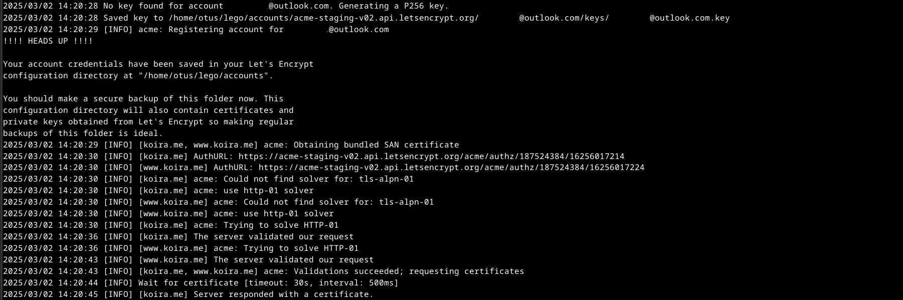
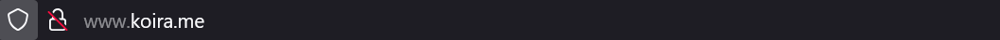

# H6 Salataampa

## a)

Ensimmäiseksi totesin, että sivut toimivat normaalisti käynnistämällä palvelimen uudelleen ja kokeilemalla sivuja selaimessa.

>sudo systemctl restart apache2

### Testisertifikaatit

Hain testiympäristön Let's Encryptin sivuilta ([letsencrypt.org](https://letsencrypt.org/fi/docs/staging-environment/)).

Loin /home/otus/Lego-kansion ja ajoin seuraavan komennon sertifikaatin hakemiseksi Let's Encryptin testipalvelimelta. Tarkistin komennon jälkeen, että uudesta kansioista löytyi sertifikaatin tiedostot.
 
>lego --server=https:<!-- -->//acme-staging-v02.api.letsencrypt.org/directory  
>--accept-tos --email=nimi<!-- -->@outlook.com  
>--domains=koira.me --domains=www<!-- -->.koira.me  
>--http --http.webroot='/home/otus/public_sites/sivusto' --path='/home/otus/lego'  
>--pem run

### Oikeat sertifikaatit

Muutin testissä käytetyn lego-kansion nimen ja loin uuden /home/otus/lego-kansion. Tarkistin kansion ja totesin sen olevan tyhjä.

Koska testi toimi moitteetta, lähdin hakemaan oikeita sertifikaatteja sivustolleni /home/otus/lego-kansioon. Käytin samaa komentoa kuin aiemmin, mutta muutin sitä tunnilla läpi käytyjen ohjeiden mukaan. Poistin ajetusta komennosta viittauksen testiympäristön palvelimeen. Komennon jälkeen tarkistin taas, että tiedostot oli luoti lego-kansioon.

>lego --accept-tos --email=email<!-- -->@outlook.com  
>--domains=koira.me --domains=www<!-- -->.koira.me  
>--http --http.webroot='/home/otus/public_sites/sivusto' --path='/home/otus/lego'  
>--pem run

### Apache2-asetukset

Lähden tekemään muutoksia palvelimen asetustiedostoon, /etc/apache2/sites-available/sivusto.conf, tunnilla tehtyjen muistiinpanojen ja tehtävänannon ohjeiden perusteella. Kopioin tiedostoon toisen virtualhostin ja muutin sen portin salatun liikenteen oletusporttiin 443. Sen jälkeen lisäsin tämän uuden virtualhostin alle rivit jotka mahdollistavat salauksen käytön (SSLEngine On) ja määrittelevät sertifikaattiin liittyvät hakemistopolut.

sudoedit /etc/apache2/sites-available/sivusto.conf

Seuraavaksi aktivoin Apache2-palvelimen SSL ominaisuudet a2enmod-komennolla. Tämän jälkeen käynnistin palvelimen uudestaan ja ajoin asetusten testikomennon, joka antoi vastaukseksi lyhyesti ja ytimekkäästi 'Syntax OK'. Jäljellä oli enää palomuurin käsittely. Avasin palomuurista portin 443 ja tarkistin viel palomuurin toiminnan ja säännöt.

>sudo a2enmod ssl  
>sudo systemctl apache2 restart  
>sudo apache2ctl configtest  
>sudo ufw allow 443/tcp  
>sudo ufw status

*** Salauksen testaaminen

Kokeilin sivuja selaimessa ja petyin pahasti. Salaus ei näyttänyt toimivan toivotulla tavalla. Sekä koira<!-- -->.me, että www<!-- -->.koira.me kertoivat salauksen puuttuvan.

>koira.me  
>www.koira.me

Kokeilin kuitenkin varalta pakottaa sivun hakemaan salattua versiota

>https://koira.me  
>https://www.koira.me

Etsin Googlella apua siihen, miten saisin ohjattua kaikki porttiin 80 tulevat haut porttiin 443. Löysin hetken etsimisen jälkeen palvelimen .conf tiedostoon lisättävän Redirect ominaisuuden. Lisäsin sen salaamattoman (port 80) virtualhostin alle Apache2-dokumentaatiosta löydetyillä ohjeilla ([apache2.org](https://httpd.apache.org/docs/2.4/rewrite/remapping.html)). Tämän muutoksen jälkeen sivut vaikuttavat toimivan salattuina oletuksena.

