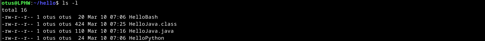

### a)

Aloitin tehtävän luomalla kolme tiedosoa, joissa hyödynsin Bash, Python ja Java kieliä. Bash ja Python olivat yksinkertaisia, ja toimivat suoraan tiedoston luonnin jälkeen ajamalla ne bash- ja python3-komennoilla. Java vaati pienen välivaiheen, jossa lähdekoodi (.java) käännetään JVM-ympäristöön sopivaan muotoon luokka-tiedostoksi (.class). Tiedostoilla on tässä vaiheessa vain rajallisesti käyttöoikeuksia, mutta tämän tehtävän kannalta sillä ei ole merkitystä, koska esimerkiksi ajo-oikeuksia (x) ei tarvita.

>micro HelloBash

```
echo Hello, Basher!
```

>micro HelloPython

```
print("Hello, Python!")
```

>micro HelloJava.java

```
public class HelloJava {
    public static void main(String[] args) {
        System.out.println("Hello, Java!");
    }
}
```


>bash HelloBash  
>python3 HelloPython  
>javac HelloJava.java  
>java HelloJava


>ls -l



### b) 

Edellisten viikkotehtävien lähteiden päivittämistä ja yleistä siistimistä. Ei raportoitavaa.

### c)

Aloitin luomalla kevyen Python-komennon, jossa pyydetään lehmää (cowsay) kertomaan kellonaika. Loin tarvittavan tiedoston käyttäjäni kotihakemistoon ja asetin sille ajo(x) oikeudet kaikille käyttäjille. Kun ohjelma toimi odotetusti, lisäsin tiedoston alkuun Pythonin komentotulkin rivillä '#!/usr/bin/python3'. Tämän jälkeen kopioin tidoston kaikille käyttäjille tarkotettujen komentojen /usr/local/bin/-hakemistoon. Tämän jälkeen testasin komentoa tyhjässä kansiossa. Tehtävä meni hyvin tunnilla saatujen ohjeiden avulla, ja selvisin ilman vastoinkäymisiä.

>micro cowtime

```
#!/usr/bin/python3

import subprocess
from datetime import datetime

valinta = input("Haluatko lehmän kertovan kellonajan (y/n)?: ")

if valinta == "y":
	aika = datetime.now()
	kello = aika.strftime("%H.%M")
	komento = ['cowsay', kello]
	subprocess.run(komento)
else:
	print("Ok...")
```

>chmod ugo+x cowtime


>cp -n cowtime /usr/local/bin  
>cowtime (tyhjässä hakemistossa)


