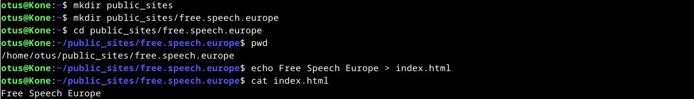

# a)

Aloitin tehtävän luomalla kolme tiedosoa, joissa hyödynsin Bash, Python ja Java kieliä. Bash ja Python olivat yksinkertaisia, ja toimivat suoraan tiedoston luonnin jälkeen ajamalla ne bash- ja python3-komennoilla. Java vaati pienen välivaiheen, jossa lähdekoodi (.java) käännetään JVM-ympäristöön sopivaan muotoon luokka-tiedostoksi (.class). Tiedostoilla on tässä vaiheessa vain rajallisesti käyttöoikeuksia, joten lisäsin kaikille käyttäjille ajo-oikeudet.

>micro HelloBash

```
echo Hello, Basher!
```

>micro HelloPython

```
print("Hello, Python!")
```

>micro HelloJava.java

```
public class HelloJava {
    public static void main(String[] args) {
        System.out.println("Hello, Java!");
    }
}
```

>chmod ugo+x *

>bash HelloBash  
>python3 HelloPython  
>javac HelloJava.java  
>java HelloJava


>ls -l


### b) 

Edellisten viikkotehtävien lähteiden päivittämistä ja yleistä siistimistä. Ei raportoitavaa.

### c)

Aloitin luomalla kevyen Python-komennon, jossa pyydetään lehmää (cowsay) kertomaan kellonaika. Loin tarvittavan tiedoston käyttäjäni kotihakemistoon ja asetin sille ajo(x) oikeudet kaikille käyttäjille. Kun ohjelma toimi odotetusti, lisäsin tiedoston alkuun Pythonin komentotulkin rivillä '#!/usr/bin/python3'. Tämän jälkeen kopioin tidoston kaikille käyttäjille tarkotettujen komentojen /usr/local/bin/-hakemistoon. Tämän jälkeen testasin komentoa tyhjässä kansiossa. Tehtävä meni hyvin tunnilla saatujen ohjeiden avulla, ja selvisin ilman vastoinkäymisiä.

>micro cowtime

```
#!/usr/bin/python3

import subprocess
from datetime import datetime

valinta = input("Haluatko lehmän kertovan kellonajan (y/n)?: ")

if valinta == "y":
	aika = datetime.now()
	kello = aika.strftime("%H.%M")
	komento = ['cowsay', kello]
	subprocess.run(komento)
else:
	print("Ok...")
```

>chmod ugo+x cowtime


>cp -n cowtime /usr/local/bin  
>cowtime (tyhjässä hakemistossa)


# d)

### a) Taustatiedot

Taustatiedot eivät ole tässä vaiheessa oleellisia.

### b) Tiivistelmä

Tehtävässä tehdään ilmeisesti virtuaalikoneeseen index.md tiedosto raportointia varten /home/user/report/-hakemistoon. Koska raportointi tapahtuu tällä kertaa GitHubin avulla, teen tiedoston vasta seuraavassa osioissa.

### c) Ei kolmea sekoseiskaa

Loin index.md tiedoston /home/otus/report/-hakemistoon ja asetin sille käyttöoikeudet, jotka antavat käyttäjälle täydet oikeudet ja poistavat oikeudet muilta.

>mkdir /home/otus/report  
>cd /home/otus/report  
>touch index.md

>chmod 700 index.md

tai

>chmod u+x index.md  
>chmod go-r index.md


### d) 'howdy'

Tässä vaiheessa oli hyvä asentaa micro-tekstieditori. Laitoin sen samalla myös oletuseditoriksi tähän sessioon.

>sudo apt-get -y install micro  
>export EDITOR=micro

Loin komennon joka kertoo kellonajan, käyttäjän nimen ja hostnamen ja muutin sen oikeuksiin ajo(x)-oikeudet kaikille käyttäjille.

>micro komento

```
#!/usr/bin/bash
echo "Kello on $(date +"%H.%M"), Käyttäjänimesi on $(whoami) ja koneesi nimi on $(hostname)"
```

>chmod ugo+x komento


Tämän jälkeen kopioin komento-tiedoston /usr/local/bin/-hakemistoon ja kokeilin sen käyttämistä tyhjästä kansiosta. Tein myös uuden testuser käyttäjän, jolla toistin saman kokeilun onnistuneesti.

>komento


>sudo adduser testuser
>su testuser
>komento


### e) Python

Loin pyyttoni-tiedoston, johon lisäsin rivin python koodia. Tämän jälkeen ajoin kyseisen tiedoston python-komentotulkin kautta.

>micro pyyttoni  
>python3 pyyttoni


### f) Etusivu uusiksi

Aloitin uusien sivujen tekemisen asentamalla Apache2:n. Tämän jälkeen tarkistin, että se on käynnissä. Testasin myös oletussivujen toiminnan localhost-osoitteella.

>sudo apt-get -y install apache2  
>sudo systemctl status apache2


Seuraavaksi loin käyttäjäni kotihakemistoon index.html tiedoston tulevaa sivua varten. Polku tiedostoon oli /home/otus/public_sites/free.speech.europe. Lisäsin tiedostoon lyhyen tekstin.

>mkdir public_sites  
>mkdir public_sites/free.speech.europe  
>cd public_sites/free.speech.europe  
>pwd  
>echo Free Speech Europe > index.html  
>cat index.html




