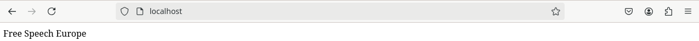
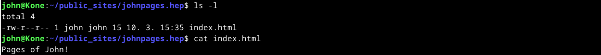

# Ajoympäristö

OS: Windows 11 Pro  
CPU: Intel Core i7-9700k @ 3.6GHz, 8 Core  
Emolevy: Z390 AORUS ELITE-CF  
Muisti: 32GB DDR4-3200  
OS SSD: 250GB Samsung EVO 860, Vapaana 116GB  
VM SSD: 1TB Samsung EVO 860, Vapaana 280GB  
GPU: Nvidia RTX 4070 12GB  
Näyttö: MSI OPTIX MAG341CQ

VirtualBox asetukset:  
Oletusasetukset, muutamia poikkeuksia lukuunottamatta.  
OS: Debian 12.9.0  
Number of CPUs: 2  
Video Memory: 256MB  
Base Memory: 6192MB  
Harddisk: 50GB

# Alkusanat

Tämän viikon tehtävässä oli pari yksinkertaista tehtävää Hello World-ohjelmiin ja uusien komentojen luomiseen. Molemmat oli käsitelty hyvin tunnilla, joten ne eivät tuottaneet juurikaan ongelmia. Raportin loppupuoliskossa teen syksyn 2024 arvioitavaa laboratorioharjoitusta. Sekin meni hyvin kertauksena, joten pyrin luottamaan myös omiin edellisten viikkojen raportteihin.

# a)

Aloitin tehtävän luomalla kolme tiedostoa, joissa hyödynsin Bash, Python ja Java kieliä. Bash ja Python olivat yksinkertaisia, ja toimivat suoraan tiedoston luonnin jälkeen ajamalla ne bash- ja python3-komennoilla. Java vaati pienen välivaiheen, jossa lähdekoodi (.java) käännetään JVM-ympäristöön sopivaan muotoon luokkatiedostoksi (.class). Tiedostoilla on tässä vaiheessa vain rajallisesti käyttöoikeuksia, joten lisäsin kaikille käyttäjille ajo-oikeudet.

>micro HelloBash

```
echo Hello, Basher!
```

>micro HelloPython

```
print("Hello, Python!")
```

>micro HelloJava.java

```
public class HelloJava {
    public static void main(String[] args) {
        System.out.println("Hello, Java!");
    }
}
```

>chmod ugo+x *

>bash HelloBash  
>python3 HelloPython  
>javac HelloJava.java  
>java HelloJava


<br />
<br />
>ls -l


<br />
<br />
# b) 

Edellisten viikkotehtävien lähteiden päivittämistä ja yleistä siistimistä. Ei raportoitavaa.

# c)

Aloitin luomalla kevyen Python-komennon, jossa pyydetään lehmää (cowsay) kertomaan kellonaika. Loin tarvittavan tiedoston käyttäjäni kotihakemistoon ja asetin sille ajo(x) oikeudet kaikille käyttäjille. Kun ohjelma toimi odotetusti, lisäsin tiedoston alkuun Pythonin komentotulkin rivillä '#!/usr/bin/python3'. Tämän jälkeen kopioin tiedoston kaikille käyttäjille tarkoitettujen komentojen /usr/local/bin/-hakemistoon. Tämän jälkeen testasin komentoa tyhjässä kansiossa. Tehtävä meni hyvin tunnilla saatujen ohjeiden avulla, ja selvisin ilman vastoinkäymisiä.

>micro cowtime

```
#!/usr/bin/python3

import subprocess
from datetime import datetime

valinta = input("Haluatko lehmän kertovan kellonajan (y/n)?: ")

if valinta == "y":
	aika = datetime.now()
	kello = aika.strftime("%H.%M")
	komento = ['cowsay', kello]
	subprocess.run(komento)
else:
	print("Ok...")
```

>chmod ugo+x cowtime


<br />
<br />
>cp -n cowtime /usr/local/bin  
>cowtime (tyhjässä hakemistossa)


<br />
<br />
# d)

Tästä eteenpäin tehtävät perustuvat syksyn 2024 laboratorioharjoitukseen ([terokarvinen.com](https://terokarvinen.com/2024/arvioitava-laboratorioharjoitus-2024-syksy-linux-palvelimet/)).

### a) Taustatiedot

Taustatiedot eivät ole tässä vaiheessa oleellisia.

### b) Tiivistelmä

Tehtävässä tehdään ilmeisesti virtuaalikoneeseen index.md tiedosto raportointia varten /home/user/report/-hakemistoon. Koska raportointi tapahtuu tällä kertaa GitHubin avulla, teen tiedoston vasta seuraavassa osioissa.

### c) Ei kolmea sekoseiskaa

Loin index.md tiedoston /home/otus/report/-hakemistoon ja asetin sille käyttöoikeudet, jotka antavat käyttäjälle täydet oikeudet ja poistavat oikeudet muilta.

>mkdir /home/otus/report  
>cd /home/otus/report  
>touch index.md

>chmod 700 index.md

tai

>chmod u+x index.md  
>chmod go-r index.md


<br />
<br />
### d) 'howdy'

Tässä vaiheessa oli hyvä asentaa micro-tekstieditori. Laitoin sen samalla myös oletuseditoriksi tähän sessioon.

>sudo apt-get -y install micro  
>export EDITOR=micro

Loin komennon joka kertoo kellonajan, käyttäjän nimen ja hostnamen ja muutin sen oikeuksiin ajo(x)-oikeudet kaikille käyttäjille ([freecodecamp.org](https://www.freecodecamp.org/news/bash-scripting-tutorial-linux-shell-script-and-command-line-for-beginners/)).

>micro komento

```
#!/usr/bin/bash
echo "Kello on $(date +"%H.%M"), Käyttäjänimesi on $(whoami) ja koneesi nimi on $(hostname)"
```

>chmod ugo+x komento


<br />
<br />
Tämän jälkeen kopioin komento-tiedoston /usr/local/bin/-hakemistoon ja kokeilin sen käyttämistä tyhjästä kansiosta. Tein myös uuden testuser käyttäjän, jolla toistin saman kokeilun onnistuneesti.

>komento


<br />
<br />
>sudo adduser testuser
>su testuser
>komento


<br />
<br />
### e) Python

Loin pyyttoni-tiedoston, johon lisäsin rivin python koodia. Tämän jälkeen ajoin kyseisen tiedoston python-komentotulkin kautta.

>micro pyyttoni  
>python3 pyyttoni


<br />
<br />
### f) Etusivu uusiksi

Aloitin uusien sivujen tekemisen asentamalla Apache2:n. Tämän jälkeen tarkistin, että se on käynnissä. Testasin myös oletussivujen toiminnan localhost-osoitteella.

>sudo apt-get -y install apache2  
>sudo systemctl status apache2


<br />
<br />
Seuraavaksi loin käyttäjäni kotihakemistoon index.html tiedoston tulevaa sivua varten. Polku tiedostoon oli /home/otus/public_sites/free.speech.europe/. Lisäsin tiedostoon lyhyen tekstin.

>mkdir public_sites  
>mkdir public_sites/free.speech.europe  
>cd public_sites/free.speech.europe  
>pwd  
>echo Free Speech Europe > index.html  
>cat index.html


<br />
<br />
Seuraavaksi siirryin luomaan palvelimelle tarvittavaa .conf tiedostoa /etc/apache2/sites-available/-hakemistoon. Käytin pohjana toimivaksi havaittua tiedostoa edelliseltä viikolta ([H4](https://github.com/zam-1/linux-course/blob/main/H4/h4-Maailma-kuulee.md)).

>sudoedit free.speech.europe.conf


<br />
<br />
Aktivoin uudet sivut ja poistin oletussivut käytöstä. Lopuksi käynnistin Apachen uudestaan.

>sudo a2ensite free.speech.europe.conf  
>sudo a2dissite 000-default.conf  
>sudo systemctl restart apache2


<br />
<br />
Lopuksi kokeilin vielä uusia sivuja selaimessa onnistuneesti localhost-osoitteella.


<br />
<br />
### g) DJ hatut

Sisältöä ei ole käsitelty kurssilla.

### h) Käyttäjät

Loin tehtävänannossa annetuille nimille käyttäjät adduser-komennolla. Annoin käyttäjille vahvat salasanat, jotka on perustuvat mahdollisesti johonkin todelliseen ja ovat ainakin teoriassa muistettavissa. Password-managereita hyödyntämällä salasanat voisivat olla kokonaan satunnaista sekasotkua.

>sudo adduser  john  
>sudo adduser  erik  
>sudo adduser  amun  
>sudo adduser  paiva  
>sudo adduser  maija


```
NIMI				TUNNUS		SALASANA
John Doe			john		nOH!1990$Tree
Erik Vähäkäähkä			erik		EkR@SunShine!22
Akhmad Amun			amun		aM*Horizon8$
Päivä Ångström			paiva		Day$5Bright*Star
Maija-Liisa Vähäaho-Virtaoja	maija 		mLvV@2025$Wave!
```

### i) Etänä

Aloitin tehtävän asentamalla openssh-serverin ja lukemalla aiemman viikon raporttiani ([H4](https://github.com/zam-1/linux-course/blob/main/H4/h4-Maailma-kuulee.md)). Asennuksen jälkeen tarkistin sen statuksen ja koitin ottaa yhteyttä localhostiin ssh:n yli. Vaikka tämä tuntunut erityisen käytännölliseltä, ainakin se toimi. Yhteys vaati odotetusti salasanan.

>sudo apt-get -y install openssh-server  
>sudo systemctl status ssh  
>ssh otus@localhost


<br />
<br />
Seuraavaksi loin uuden SSH-avainparin. Luonti tapahtui oletuksena /home/otus/.ssh/ kansioon. Tarkistin tiedostojen ja hakemistojen oikeudet, ja ne vaikuttivat hyviltä, enkä puuttunut niihin tässä vaiheessa.

>ssh-keygen


<br />


<br />
<br />
Kopioin id_rsa.pub tiedoston sisällön authorized_keys tiedostoon. Apua sain Digital Oceanin materiaalista ([digitalocean.com](https://www.digitalocean.com/community/tutorials/how-to-configure-ssh-key-based-authentication-on-a-linux-server)). Koitin uudestaan SSH-yhteyttä, ja tällä kertaa se muodostui ilman salasanaa. Ymmärtääkseni tehtävä oli tässä vaiheessa suoritettu.

>cp id_rsa.pub authorized_keys  
>ssh otus@localhost
<br />
<br />


### j) Tee käyttäjille mahdollisuus tehdä kotisivuja

Käytin apuna vanhaa tehtävää ([H3](https://github.com/zam-1/linux-course/blob/main/H3/h3-Hello-Web-Server.md)), jonka avulla lähdin luomaan sivuja käyttäjille. Loin tehtävän aika sivut vain kahdelle käyttäjälle, koska loput olisivat vain olleet saman kopioimista. Tehtävä noudattelee suurimmaksi osin kohdassa 'f) Etusivu uusiksi' tehtyjä toimenpiteitä. Erona oli se, että käytin index.html tiedoston tekemiseen sivuja ylläpitäviä käyttäjiä, koska halusin, että käyttöoikeudet menevät kerralla oikein. Loput toimenpiteet pystyin tekemään pääkäyttäjälläni. Tein kahdelle käyttäjälle, john ja erik, kotikansioihin tarvittavat tiedostot. Käytän jatkossa esimerkkinä john-käyttäjän sivuja, mutta tein samalla myös erikin sivut.


<br />
<br />
Seuraavaksi kopioin ja muuntelin .conf tiedoston edellisessä osiossa tehdystä free.speech.europe.conf tiedostosta.


<br />
<br />
Viimeisenä työnä lisäsin /etc/hosts tiedostoon tarvittavat lisäykset.


<br />
<br />
Lopuksi aktivoin uudet sivut, käynnistin Apache2:n uudestaan ja testasin niitä selaimen kautta.

>sudo a2ensite johnpages.hep  
>sudo systemctl restart apache2


<br />
<br />
Loput käyttäjät saisivat sivunsa samoilla keinoilla.

### k)

Sisältöä ei ole käsitelty kurssilla.

### i)

Sisältöä ei ole käsitelty kurssilla.
<br />
<br />
<br />
<br />
<br />
<br />
## Lähteet
Karvinen, Tero 2025: Linux Palvelimet 2025 alkukevät. https://terokarvinen.com/linux-palvelimet/  
Zam-1 2025: h3-Hello-Web-Server. https://github.com/zam-1/linux-course/blob/main/H3/h3-Hello-Web-Server.md  
Zam-1 2025: h4-Maailma-kuulee. https://github.com/zam-1/linux-course/blob/main/H4/h4-Maailma-kuulee.md  
Ellingwood, Justin & Boucheron, Brian & Singh, Anish 2025: How to Create an SSH Key in Linux: Easy Step-by-Step Guide. https://www.digitalocean.com/community/tutorials/how-to-configure-ssh-key-based-authentication-on-a-linux-server  
Hira, Zaira 2023: Bash Scripting Tutorial – Linux Shell Script and Command Line for Beginners. https://www.freecodecamp.org/news/bash-scripting-tutorial-linux-shell-script-and-command-line-for-beginners/  
Karvinen, Tero 2024: arvioitava-laboratorioharjoitus-2024-syksy-linux-palvelimet. https://terokarvinen.com/2024/arvioitava-laboratorioharjoitus-2024-syksy-linux-palvelimet/


<br />
<br />
<br />
<br />
<br />
<br />
<br />
<br />
<br />
Tätä dokumenttia saa kopioida ja muokata GNU General Public License (versio 2 tai uudempi) mukaisesti. http://www.gnu.org/licenses/gpl.html
Pohjana Tero Karvinen 2012: Linux kurssi, http://terokarvinen.com
